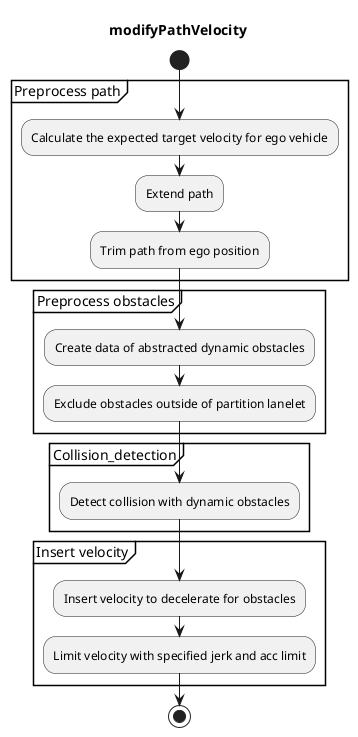
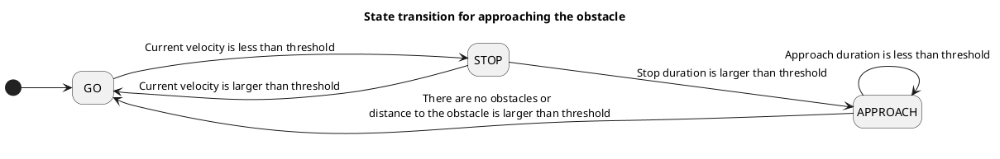

## 障害物回避

### 役割

`run_out` は、歩行者、自転車、オートバイなどの動的障害物に対して減速・停止を行うモジュールです。

### 起動タイミング

このモジュールは、`launch_run_out` が True になると起動します。

### 内部動作 / アルゴリズム

#### フローチャート

#### パスを事前処理する

##### 自車に対する予測目標速度を計算する

障害物との衝突時間をより正確に計算するために、自車パスの予測目標速度を計算します。
予測目標速度は、現在の速度、現在の加速度、マップと外部APIによって指示された速度制限を使用して、[autoware velocity smootherモジュール](https://github.com/autowarefoundation/autoware.universe/tree/main/planning/autoware_velocity_smoother)で計算されます。

##### パスを延長する

パスは目標地点の後の障害物を考慮するために、ベースリンクの長さの前方に延長されます。

##### 自車位置からパスをトリムする

計算時間を削減するため、自車位置からある程度距離があるパスはトリムされます。
トリム距離は`detection_distance`のパラメータで指定されます。

#### 障害物を事前処理する

##### 動的障害物を抽象化したデータを作成する

このモジュールは、障害物の抽象化されたダイナミックデータレイヤーを作成することによって、複数のタイプの障害物に対処できます。現在、抽象障害物データを作成するための3タイプの検出方法（Object、ObjectWithoutPath、Points）があります。

###### 抽象化されたダイナミック障害物

障害物の抽象化されたデータには、次の情報が含まれています。

| 名称             | 型                                                                | 説明                                                                                                                                                   |
| ---------------- | -------------------------------------------------------------------- | ------------------------------------------------------------------------------------------------------------------------------------------------------------------ |
| 位置             | `geometry_msgs::msg::Pose`                                          | 障害物の位置                                                                                                                                                |
| 分類             | `std::vector<autoware_perception_msgs::msg::ObjectClassification>` | 確率のある分類                                                                                                                                             |
| 形状             | `autoware_perception_msgs::msg::Shape`                             | 障害物の形状                                                                                                                                                |
| 予測経路         | `std::vector<DynamicObstacle::PredictedPath>`                       | 信頼度のある予測経路。このデータには、最小速度と最大速度を使用するため、タイムステップがありません。                                                   |
| 最小速度 (m/s)     | `float`                                                             | 障害物の最小速度。パラメータ `dynamic_obstacle.min_vel_kmph` で指定されています。                                                                       |
| 最大速度 (m/s)     | `float`                                                             | 障害物の最大速度。パラメータ `dynamic_obstacle.max_vel_kmph` で指定されています。                                                                       |

オブジェクトの最大/最小速度をパラメータとして入力し、予想速度に十分なマージンを追加します。このパラメータは、[衝突検出](.#衝突検出)の多角形を作成するために使用されます。

将来の作業: オブジェクトの共分散に基づいて予測速度から最大/最小速度を特定します。

###### 3種類の検出方法

私たちは異なる安全性と可用性の要件を満たすために3種類の検出方法を用意しています。その特性は下の表に示されています。
`Object`の方法は、予測経路が車線上のオブジェクトのみを検出するため、高い可用性(誤検出が少ない)があります。しかし、認識が障害物を検出できなかったり、予測経路が不正になったりする場合には安全ではないことがあります。
一方、`Points`の方法は、入力として点群を使用するため、高い安全性(誤認が少ない)があります。点は予測経路を持たないため、自車経路に垂直な方向に移動する経路が抽象化された動的障害物データの予測経路と見なされます。しかし、ポイントフィルタを適切に調整しなければ、多くのポイントを検出する可能性があり、可用性が非常に低くなります。
`ObjectWithoutPath`は、`Object`と`Points`の中間に位置する特性を持っています。

| 手法 | 説明 |
|---|---|---|
| オブジェクト | 衝突検出に予測パス付きのオブジェクトを使用する。 |
| ObjectWithoutPath | オブジェクトを使用するが、衝突検出に予測パスを使用しない。オブジェクトが指定された速度で車線に飛び出すことを前提にパスを置き換える。 |
| ポイント | 衝突検出にフィルタされたポイントを使用する。ポイントは車線に飛び出すことを前提にパスが作成される。ポイントは小さな円形の障害物とみなされる。 |

## 自動運転ソフトウェアドキュメント

### 動的障害物

#### パーティション外の障害物の除外

このモジュールは、ガードレール、フェンス、壁などのパーティション外の障害物を除外できます。この機能を使用するには、パーティションの情報を持つレーンレットマップが必要です。この機能により、車線に飛び出す可能性が低い障害物による不要な減速を減らすことができます。`use_partition_lanelet`パラメータを使用して、この機能を使用するかどうかを選択できます。

#### ラベルによる障害物の除外

このモジュールは、`target_obstacle_types`パラメータで定義されたターゲット障害物にのみ作用します。このパラメータで指定されていないタイプの障害物が検出された場合、このモジュールによって無視されます。

#### 自車走行経路上にある障害物の除外

障害物がすでに自車走行経路上に存在する場合、障害物は自車の経路に「割り込む」ことはできないため（このモジュールで処理しようとしている状況です）、自車のフットプリント経路上にすでに存在する障害物を除外すると有用な場合があります。`exclude_obstacles_already_in_path`パラメータを`true`に設定すると、このモジュールは`keep_obstacle_on_path_time_threshold`を超えて自車走行経路上にあると見なされる障害物を除外します。このモジュールは、各障害物の現在の位置に対して自車の最寄りの経路ポイントを考慮し、障害物と自車の左右の側の間の横方向距離を決定します。障害物がそのポーズに対して車の左端と右端の間に位置する場合、それは自車のフットプリント経路内にあると見なされ、除外されます。障害物が経路内にあるかどうかを検出するために使用される車両の仮想幅は、`ego_footprint_extra_margin`パラメータで調整できます。

#### 自車の「カットライン」を横断する障害物の除外

このモジュールは、自車の後部を横断する予測経路を持つ障害物を除外できます。予測経路が自車の「カットライン」を横断する場合に障害物を除外します。「カットライン」は自車に垂直で、自車のベースリンクを通過する仮想線分です。

`use_ego_cut_line`パラメータを`true`または`false`に設定することで、この機能を使用するかどうかを選択できます。線の幅は、`ego_cut_line_length`パラメータで調整できます。

#### 衝突検出

#### 動的障害物との衝突検出

自車走行経路に沿って、各`detection_span`で衝突検出を実行するポイントを決定します。

各ポイントまでの移動時間は、[自車予想ターゲット速度](.#Calculate-the-expected-target-velocity-for-ego-vehicle)から計算されます。

各ポイントについて、自車のフットプリントポリゴンと障害物の予測位置のポリゴンを使用して衝突検出を実行します。障害物の予測位置は、最小速度、最大速度、およびその点に対する自車の移動時間で計算される範囲を持つ長方形またはポリゴンとして記述されます。動的障害物の入力タイプが`Points`の場合、障害物形状は小さな円筒として定義されます。

衝突検出は2つのポリゴン間で計算されるため、複数のポイントが衝突ポイントとして検出されます。そのため、障害物と同じ側で自車に近いポイントを衝突ポイントとして選択します。

#### 速度の挿入

#### 障害物に対して減速する速度の挿入

衝突が検出された場合、選択された衝突ポイントからベースリンクから前方までの距離+停止マージンに停止点が挿入されます。ベースリンクから前方とは、ベースリンク（後輪軸の中央）と車の前面の間の距離を意味します。停止マージンは`stop_margin`パラメータで決定されます。

#### 障害物に接近するための速度の挿入

`Points`または`ObjectWithoutPath`の方法を選択すると、自車が障害物の前で停止し続ける場合があります。

`approaching.enable` のパラメータが true に設定されると、エゴは `state.stop_time_thresh` 秒間停止した後、障害物に接近します。接近時の最大速度は `approaching.limit_vel_kmph` のパラメータで指定できます。障害物に接近するかどうかの決定は、次の図のような単純な状態遷移によって決定されます。

##### 指定ジャークおよび加速度極限を使用して速度を制限

急減速しすぎないように最大減速速度を計算します。詳細については、[閉塞スポットドキュメント](../autoware_behavior_velocity_occlusion_spot_module/#maximum-slowdown-velocity)を参照してください。
この機能を使用するかどうかは `slow_down_limit.enable` パラメータで選択できます。

### モジュールパラメータ

| パラメータ名 | タイプ | 説明 |
|---|---|---|
| `detection_method` | 文字列 | [-] 候補: Object, ObjectWithoutPath, Points |
| `target_obstacle_types` | 文字ベクトル | [-] モジュールが考慮する障害物タイプを指定します。障害物の分類タイプがここに記載されていない場合、無視されます。候補: ["PEDESTRIAN", "BICYCLE","MOTORCYCLE"] |
| `use_partition_lanelet` | ブール | [-] 分割laneletマップデータを使用するかどうか |
| `specify_decel_jerk` | ブール | [-] 自車が減速するときのジャークを指定するかどうか |
| `stop_margin` | double | [m] 車両はこのマージンを保持して停止できるよう減速します |
| `passing_margin` | double | [m] 障害物より先に予測位置にある車両の前方が障害物 + このマージンに達したときに車両の加速を開始します |
| `deceleration_jerk` | double | [m/s^3] 障害物のために停止するときに自車がこのジャークで減速します |
| `detection_distance` | double | [m] 自車の前方距離から障害物を検出します |
| `detection_span` | double | [m] 計算時間を短縮するために、この間隔で衝突を計算します |
| `min_vel_ego_kmph` | double | [km/h] 衝突までの時間を計算するための最小速度 |

| パラメータ /detection_area | 型   | 説明                                      |
| ------------------------- | ------ | ----------------------------------------- |
| `margin_ahead`            | double | 検出エリア多角形の前方マージン [m]       |
| `margin_behind`           | double | 検出エリア多角形の後方マージン [m]      |

| パラメータ | タイプ | 説明 |
|---|---|---|
| `use_mandatory_area` | double | [-] 強制検出領域を使用するかどうか |
| `assume_fixed_velocity.enable` | double | [-] 有効な場合、障害物の速度は以下に指定した最小速度と最大速度の範囲内と見なされます |
| `assume_fixed_velocity.min_vel_kmph` | double | [km/h] 動的障害物の最小速度 |
| `assume_fixed_velocity.max_vel_kmph` | double | [km/h] 動的障害物の最大速度 |
| `diameter` | double | [m] 障害物の直径。ポイントから動的障害物を作成するために使用されます |
| `height` | double | [m] 障害物の高さ。ポイントから動的障害物を作成するために使用されます |
| `max_prediction_time` | double | [秒] この時間まで予測経路を作成します |
| `time_step` | double | [秒] 各パスステップのタイムステップ。パスを含まないポイントまたはオブジェクトから動的障害物を作成するために使用されます |
| `points_interval` | double | [m] この間隔で障害物ポイントをグループに分割し、最も近くにある横方向のポイントのみを検出します。ポイントメソッドでのみ使用されます |

| パラメータ /approaching | タイプ | 説明 |
| ------------------------ | ------ | ----------------------------------------------------- |
| `enable`                 | bool   | [-] 停止後に接近を有効にするかどうか |
| `margin`                 | double | [m] 自車が障害物に接近する方法の距離 |
| `limit_vel_kmph`       | double | [km/h] 停止後に接近するための速度制限 |

| パラメータ/状態         | 型   | 説明                                                                          |
| ------------------------ | ------ | ---------------------------------------------------------------------------------- |
| `stop_thresh`            | double | [m/s] エゴが停止状態であると判定するための閾値                                       |
| `stop_time_thresh`       | double | [sec] 停止状態から接近状態に移行するための停止時間閾値                             |
| `disable_approach_dist`  | double | [m] 障害物との距離がこの値より長い場合に接近状態を終了する                           |
| `keep_approach_duration` | double | [sec] 状態遷移のチャタリングを避けるため、接近状態をこの期間保持する                     |

| パラメータ /slow\_down\_limit | 型   | 説明                                                     |
| ----------------------------- | ------ | -------------------------------------------------------- |
| `enable`                     | bool   | [-] 最大ジャークと加速度で速度を制限するかどうか          |
| `max\_jerk`                 | double | [m/s^3] 安全なブレーキのための最小ジャーク減速度。        |
| `max\_acc`                  | double | [m/s^2] 安全なブレーキのための最小加速度減速度。        |

| パラメーター /ignore_momentary_detection | タイプ   | 説明                                                           |
|------------------------------------------|-----------|-----------------------------------------------------------------|
| `enable`                                   | bool      |[-] 一時的な検出を無視するかどうか                         |
| `time_threshold`                           | double    | [秒] この期間より短い検出を無視する |

### 今後の拡張 / 未実装の部分

- 共分散から障害物の最小速度と最大速度を計算する
- ポリゴンオブジェクトとの衝突を検出する
- 障害物の予測経路が直線でない場合の処理
  - 現在、衝突チェックは障害物の予測経路が直線であるという仮定に基づいて計算されています

