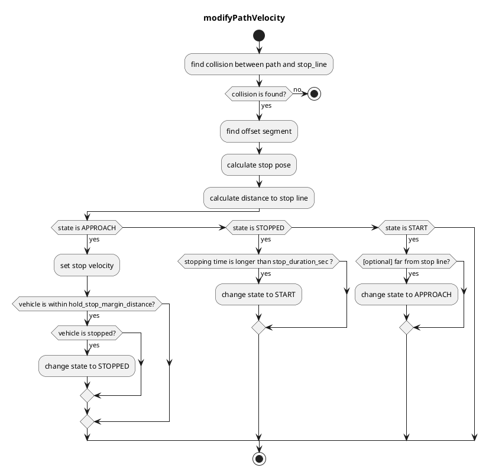

# Stop Line

## Role

This module plans the vehicle's velocity to ensure it stops just before stop lines and can resume movement after stopping.

## Activation Timing

This module is activated when there is a stop line in a target lane.

## Module Parameters

| Parameter                       | Type   | Description                                                                                                                                                                       |
| ------------------------------- | ------ | --------------------------------------------------------------------------------------------------------------------------------------------------------------------------------- |
| `stop_margin`                   | double | Margin that the vehicle tries to stop in before stop_line                                                                                                                         |
| `stop_duration_sec`             | double | [s] Time parameter for the ego vehicle to stop before stop line                                                                                                                   |
| `hold_stop_margin_distance`     | double | [m] Parameter for restart prevention (See Algorithm section). Also, when the ego vehicle is within this distance from a stop line, the ego state becomes STOPPED from APPROACHING |
| `use_initialization_stop_state` | bool   | Flag to determine whether to return to the approaching state when the vehicle moves away from a stop line.                                                                        |

## Inner-workings / Algorithms

- Gets a stop line from map information.
- Inserts a stop point on the path from the stop line defined in the map and the ego vehicle length.
- Sets velocities of the path after the stop point to 0[m/s].
- Releases the inserted stop velocity when the vehicle halts at the stop point for `stop_duration_sec` seconds.

### Flowchart

This algorithm is based on `segment`.
`segment` consists of two node points. It's useful for removing boundary conditions because if `segment(i)` exists we can assume `node(i)` and `node(i+1)` exist.

First, this algorithm finds a collision between reference path and stop line.
Then, we can get `collision segment` and `collision point`.

Next, based on `collision point`, it finds `offset segment` by iterating backward points up to a specific offset length.
The offset length is `stop_margin`(parameter) + `base_link to front`(to adjust head pose to stop line).
Then, we can get `offset segment` and `offset from segment start`.

After that, we can calculate an offset point from `offset segment` and `offset`. This will be `stop_pose`.

### Restart Prevention

If the vehicle requires X meters (e.g. 0.5 meters) to stop once it starts moving due to poor vehicle control performance, it may overshoot the stopping position, which must be strictly observed. This happens when the vehicle begins to move in order to approach a nearby stop point (e.g. 0.3 meters away).

This module includes the parameter `hold_stop_margin_distance` to prevent redundant restarts in such a situation. If the vehicle is stopped within `hold_stop_margin_distance` meters of the stop point (\_front_to_stop_line < hold_stop_margin_distance), the module determines that the vehicle has already stopped at the stop point and will maintain the current stopping position, even if the vehicle has come to a stop due to other factors.

<figure markdown>
  {width=1000}
  <figcaption>parameters</figcaption>
</figure>

<figure markdown>
  {width=1000}
  <figcaption>outside the hold_stop_margin_distance</figcaption>
</figure>

<figure markdown>
  {width=1000}
  <figcaption>inside the hold_stop_margin_distance</figcaption>
</figure>
