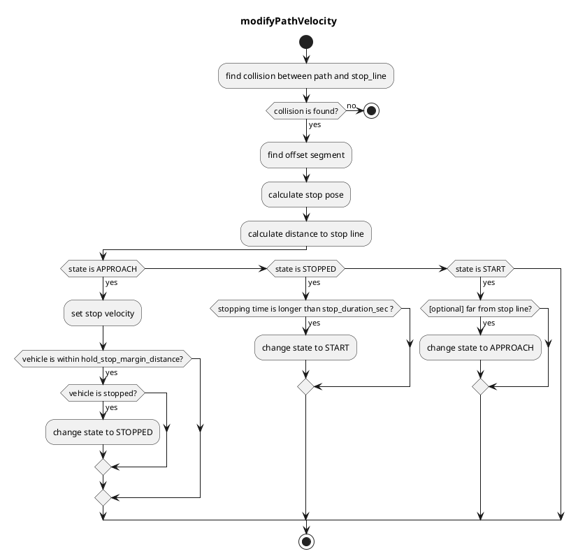

## 停止線

### 役割

このモジュールは、車両が停止線の手前で停止し、停止後に再発進できるように速度を計画します。

### 作動タイミング

このモジュールは、ターゲット車線に停止線があるときに作動します。

### モジュールパラメータ

| パラメータ                        | タイプ   | 説明                                                                                                                                                                       |
| -------------------------------- | ------ | --------------------------------------------------------------------------------------------------------------------------------------------------------------------------------- |
| `stop_margin`                    | 倍精度 | 車両が停止線前に停止しようとするマージン                                                                                                                          |
| `stop_duration_sec`              | 倍精度 | [秒] 自己車両が停止線の前で停止する時間パラメータ                                                                                                            |
| `hold_stop_margin_distance`      | 倍精度 | [メートル] 再始動防止パラメータ（アルゴリズムセクションを参照）。また、自己車両がこの距離より停止線に近い場合、自己状態は接近から停止に変わります |
| `use_initialization_stop_state`  | ブール | 車両が停止線から離れる場合に接近状態に戻すかどうかを決定するフラグ                                                                      |
| `show_stop_line_collision_check` | ブール | 停止線との衝突チェックのデバッグ情報を表示するかどうかを決定するフラグ                                                                                     |

### 内部動作 / アルゴリズム

- 地図情報から停止線を取得します。
- 地図で定義された停止線と自車長からパス上に停止点を挿入します。
- 停止点以降のパスの速度を 0[m/s] に設定します。
- 車両が停止点で `stop_duration_sec` 秒間停止しているときに、挿入された停止速度を解除します。

#### フローチャート

このアルゴリズムは「セグメント」に基づいています。
「セグメント」は2つのノードポイントで構成されています。`セグメント(i)`が存在すれば、`ノード(i)`と`ノード(i+1)`が存在すると仮定できるため、境界条件を削除するのに役立ちます。

最初に、このアルゴリズムはリファレンスパスと停止線間の衝突を検出します。
次に、「衝突セグメント」と「衝突ポイント」を取得できます。

次に、「衝突ポイント」に基づいて、「post resampling」ポイントを特定のオフセット長まで後方ポイントを反復処理することによって「オフセットセグメント」を検出します。
オフセットの長さは、`停止マージン`（パラメータ）+ `base_link～前方`（先頭ポーズを停止線に調整するため）です。
次に、「オフセットセグメント」と「セグメント開始からのオフセット」を取得できます。

その後、「オフセットセグメント」と「オフセット」からオフセットポイントを計算できます。 これが「停止ポーズ」です。

#### 再始動防止

車両の制御性能が低下しているため、車両が動き始めると停止するために X メートル（例: 0.5 メートル）が必要な場合、車両は停止点を通過します。車両が動き始めて停止点に近づく（例: 0.3 メートル先）ときに、厳守する必要があります。

このモジュールには、これらの不要な再始動を防ぐためのパラメータ `hold_stop_margin_distance` があります。車両がモジュールの停止点から `hold_stop_margin_distance` メートル以内で停止している場合（\_front_to_stop_line < hold_stop_margin_distance）、車両はモジュールの停止点に対してすでに停止していると判断し、車両が他の要因で停止している場合でも、現在の位置で停止し続けるように計画します。

<figure markdown>
  {width=1000}
  <figcaption>パラメータ</figcaption>
</figure>

<figure markdown>
  {width=1000}
  <figcaption>hold_stop_margin_distance の外部</figcaption>
</figure>

<figure markdown>
  {width=1000}
  <figcaption>hold_stop_margin_distance の内部</figcaption>
</figure>

