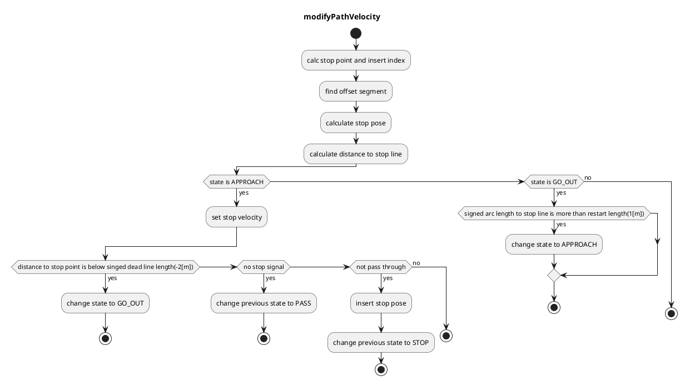

### 信号機

#### 役割

車両が交差点に進入できるかどうかを信号機の状態によって判断し、必要に応じて停止時の速度を計画します。このモジュールは、開発者が挙動を設計しやすいルールベースの速度決定のために設計されています。信号機シーンに適した速度を生成します。

### 制限事項

このモジュールにより、開発者は特定のルールを使用して、信号機モジュールでの停止/進行を設計できます。ルールベースの計画の性質により、このアルゴリズムは、信号機を考慮した物体検出と認識の精度に大きく依存します。また、このモジュールは信号機シーンでの停止/進行のみを処理します。したがって、交通状況に応じた急ぎ足または迅速な決定は今後の課題です。

#### 起動タイミング

このモジュールは、自車レーンに信号機があるときに起動します。

#### アルゴリズム

1. 地図情報から、ルートにマップされた信号機と信号機に対応する停止線を取得します。

   - 対応する信号機信号が一度も検出されない場合、通過する信号として扱います。

   - 対応する信号機信号が検出されるがタイムアウトした場合、停止する信号として扱います。

2. 信号機認識結果の中で最も信頼性の高いものを採用し、その色が緑または対応する矢印信号ではなかった場合、停止点を生成します。

   - 停止信号を受信する経過時間が `stop_time_hysteresis` 未満の場合、通過する信号として扱います。この機能は、チャタリングを防ぐためのものです。

3. 車両の現在の速度が

   - 2.0m/s 以上 ⇒ 通過判断（次のスライドの式を使用して）

   - 2.0m/s 未満 ⇒ 停止

4. 車両が停止線までに停止できないと判断された場合、Autoware は次のいずれかの動作を選択します。

   - 黄信号中に停止線を「通過可能」 => 通過

   - 黄信号中に停止線を「通過不可」 => 緊急停止

#### ジレンマゾーン

- 黄信号線

  黄信号中に車両が移動する距離を示す「黄信号線」と呼ばれます。

- ジレンマゾーン

  次の条件を満たす「ジレンマゾーン」と呼ばれます。

  - 車両は黄信号中に停止線を通過できません（黄信号線の右側）。

  - 車両は減速とジャーク限界内では停止できません（通過判断曲線の左側）。

    ⇒ 緊急停止（交通規則を守るために減速とジャークの制限を緩和）

「オプションゾーン」と呼ばれ、以下の条件を満たすものです。

- 車両は黄色のランプ線（黄色いランプ線の左側）の間に停止線を通過できます。
- 車両は減速およびジャークの限界で停止できます。（パス判定曲線の右側） ⇒ 停止（Autowareが安全な選択肢を選択します）

#### モジュールパラメータ

| パラメータ | 型 | 説明 |
|---|---|---|
| `stop_margin` | double | [m] 停止点手前の余裕 |
| `tl_state_timeout` | double | [s] 検出された信号機の結果のタイムアウト |
| `stop_time_hysteresis` | double | [s] チャタリング防止のための停止計画の決定に関する時間閾値 |
| `yellow_lamp_period` | double | [s] 黄色のランプ時間 |
| `enable_pass_judge` | bool | [-] 通過判定を使用するかどうか |

#### フローチャート

##### 既知の限界

- 現在確認中

