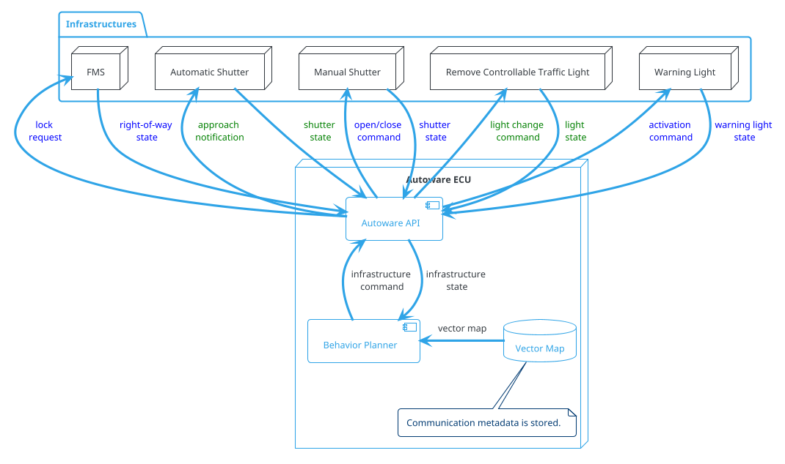
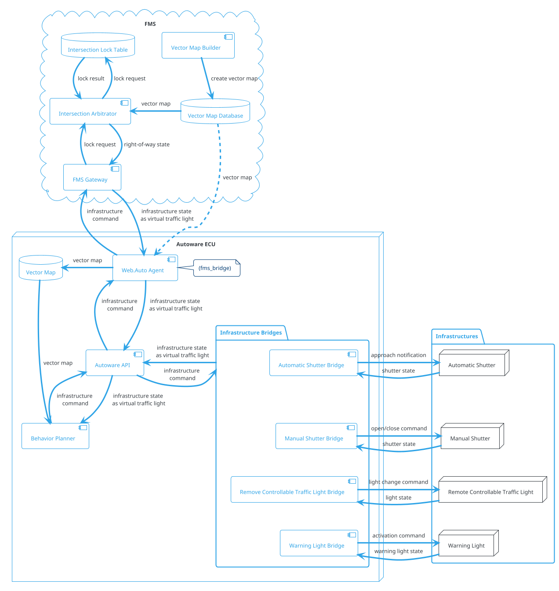
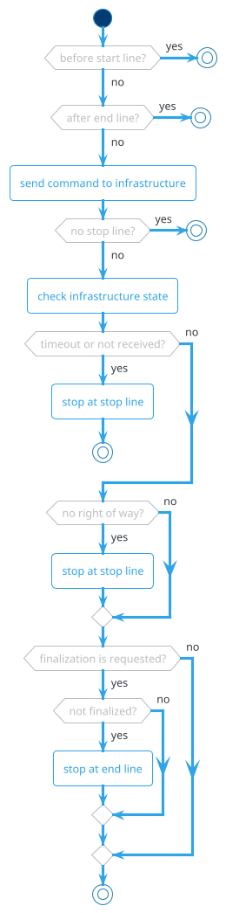

### バーチャル交通信号機

#### 役割

自動運転車は、以下のようなインフラと連携する必要があります。

- 倉庫のシャッター
- V2X対応信号機
- 交差点の通信機器
- フリート管理システム (FMS)

例を以下に示します。

1. V2X対応信号機による交通制御
   

2. FMSによる複数の車両の交差点調整
   

これらの機能は個別に実現することもできますが、ユースケースは次の3つの要素で一般化できます。

1. `start`: 車両が特定のゾーンに入った後、連携手順を開始します。
2. `stop`: インフラから受信したステータスに従って、定義された停止線で停止します。
3. `end`: 車両が終了ゾーンに到達した後、連携手順を完了します。これは、安定した通信範囲内で行う必要があります。

このモジュールは、インフラからステータスを送受信し、連携結果の速度を計画します。

### システム構成図

プランナーと各インフラストラクチャは共通抽象メッセージを使用して相互に通信します。

- 各インフラストラクチャに対する特別な処理は拡張性がありません。インターフェイスは Autoware API として定義されています。
- 各インフラストラクチャの要件はわずかに異なりますが、柔軟に対応します。

FMS: 複数の車両が運用中で関連レーンの占有がある場合の交差点調整

- 自動シャッター: 接近時にシャッターを開き、離開時に閉じる
- 手動シャッター: ドライバーにシャッターを開閉してもらう。
- リモートコントロール信号: ドライバーに進行方向に合わせて信号状態を変更してもらう。
- 警告灯: 警告灯を作動させる。

インフラストラクチャごとに異なる通信方法をサポートする

- HTTP
- Bluetooth
- ZigBee

地理的な場所ごとに異なるメタ情報を保有する

- 関連するレーン ID
- ハードウェア ID
- 通信方式

FMS: フリートマネジメントシステム

#### モジュールパラメータ

## 自動運転ソフトウェア パラメータ

| パラメータ | 型 | 説明 |
|---|---|---|
| `max_delay_sec` | double | [秒] コマンドの最大許容遅延 |
| `near_line_distance` | double | [m] 停車線を停止するために停止線までの距離のしきい値 |
| `dead_line_margin` | double | [m] このモジュールが停止線を挿入し続けるしきい値 |
| `hold_stop_margin_distance` | double | [m] 再起動防止のパラメータ（以降のセクションを参照） |
| `check_timeout_after_stop_line` | bool | [-] リンクが切断されたときに停止するタイムアウトの確認 |

#### 再始動防止

車両の制御性能が低下するために、車両の動き始め時に停止するのに X メートル（例: 0.5 メートル）を要する場合、車両は停止点に近づこうとして動き始めるときは厳守すべき停止位置を超過します（例: 0.3 メートル距離）。

このモジュールには、これらの余分な再始動を防止するためのパラメータ `hold_stop_margin_distance` があります。車両がモジュールの停止位置（_front_to_stop_line < hold_stop_margin_distance）から `hold_stop_margin_distance` メーター以内に停止した場合、モジュールは車両がモジュールの停止位置で既に停止していると判断し、他の要素により車両が停止した場合にも、現在の位置で停止し続けることを計画します。

<figure markdown>
  {width=1000}
  <figcaption>パラメータ</figcaption>
</figure>

<figure markdown>
  {width=1000}
  <figcaption>hold_stop_margin_distanceの外側</figcaption>
</figure>

<figure markdown>
  {width=1000}
  <figcaption>hold_stop_margin_distanceの内側</figcaption>
</figure>

#### フローチャート

#### マップフォーマット

- 急ブレーキを回避するため、仮想信号機の始点と停止線の距離は、始点通過時の速度が$v_0$で、Autowareで定義された最小加速度が$a_{\mathrm{min}}$と仮定して計算される$l_{\mathrm{min}}$よりも長くなければなりません。

$$
\begin{align}
l_{\mathrm{min}} = -\frac{v_0^2}{2 a_{\mathrm{min}}}
\end{align}
$$

#### 制限事項

- 未定

