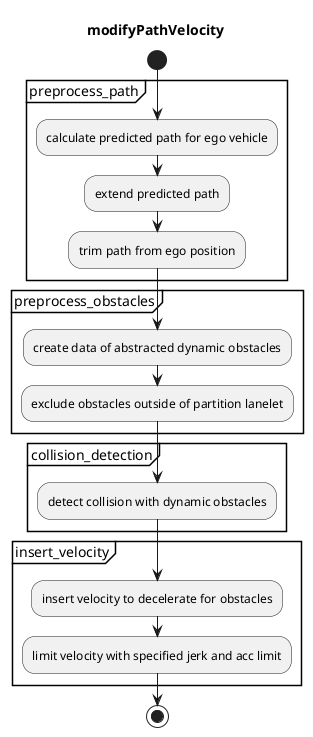
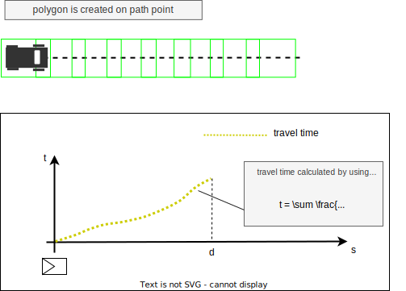

## Dynamic Obstacle Stop

### Role

`dynamic_obstacle_stop` is the module that decelerates and stops for dynamic obstacles such as pedestrians and bicycles.

### Activation Timing

This module is activated if `launch_dynamic_obstacle_stop` becomes true

### Inner-workings / Algorithms

#### Flow chart

#### preprocess path
##### calculate predicted path for ego vehicle
calculate predicted path to predict collisions with obstacles more precisely.
predicted path is calculated from motion velocity smoother module by using current velocity, current acceleration, and velocity in map.

##### extend predicted path
Predicted Path is extended by the length of base link to front to consider obstacles after the goal.

##### trim path from ego position
Predicted Path is trimmed from ego position to a certain distance to reduce calculation time.
Trimmed distance is specified by parameter of `detection_distance`.

#### preprocess obstacles
##### create data of abstracted dynamic obstacles
This module can handle multiple types of input type of obstacles by creating abstracted dynamic obstacle data from input data. Currently we have 3 types of method (Object, ObjectWithoutPath, Points) to create abstracted obstacle data. 
abstracted obstacle data has following information.
In method of Points, we should specify the velocity that is enough large for safety, but obstacles are likely to pass through the lane and not being detected. So we use min and max velocity.
Min and max velocity are specified by parameter of `dynamic_obstacle.min_vel_kmph` and `dynamic_obstacle.max_vel_kmph`. (In case of Object method, we also use this parameter, but in the future it will be replaced with velocity calculated by twist with covariance that predicted object has.)

| Name               | Type                                                                   | Description
| -------------------| ------                                                                 | -------------
| pose               | `geometry_msgs::msg::Pose`                                             | pose of the obstacle
| classifications    | `std::vector<autoware_auto_perception_msgs::msg::ObjectClassification>`| classifications with probability
| shape              | `autoware_auto_perception_msgs::msg::Shape`                            | shape of the obstacle
| predicted_paths    | `std::vector<DynamicObstacle::PredictedPath>`                          | predicted paths with confidence. this data doesn't have time step because we use minimum and maximum velocity instead.
| min_velocity_mps   | `float`                                                                | minimum velocity of the obstacle. specified by parameter of `dynamic_osbtacle.min_vel_kmph`
| max_velocity_mps   | `float`                                                                | maximum velocity of the obstacle. specified by parameter of `dynamic_osbtacle.max_vel_kmph`

##### exclude obstacles outside of partition
This module can exclude the obstacles outside of partition such as guardrail, fence, and wall.
We need lanelet map that has the information of partition to use this feature.
By this feature, we can reduce unnecessary deceleration by obstacles that are unlikely to jump out to the lane.
You can choose whether to use this feature by parameter of `use_partition_lanelet`.

#### collision detection
##### detect collision with dynamic obstacles
to detect collision with obstacles, we calculate the travel time to the forward path points from the predicted path.
Then, create the polygon of vehicle shape on each path point, and detect collision for each polygon.
Interval of polygon creation is specified by the parameter of `detection_span`. We use this parameter to reduce calculation time.

For each created polygon, obstacle collision possibility is calculated.
obstacles are described as rectangle or polygon that has range from min velocity to max velocity.
For Points, the obstacles is defined as a small cylinder object.

Multiple points are detected as collision points because collision detection is calculated between two polygons.
So we select the point that is on the same side as the obstacle and close to ego vehicle as the collision point.

#### insert velocity
##### insert velocity to decelerate for obstacles
If the collision is detected, stop point is inserted on distance of base link to front + stop margin from the selected collision point. The base link to front means the distance between base_link (center of rear-wheel axis) and front of the car. stop margin is determined by the parameter of `stop_margin`.

##### limit velocity with specified jerk and acc limit
The maximum slowdown velocity is calculated in order not to slowdown too much.
See the [Occlusion Spot document](./occlusion-spot-design.md#maximum-slowdown-velocity) for more details.
You can choose whether to use this feature by parameter of `slow_down_limit.enable`.

### Module Parameters

| Parameter              | Type   | Description
| -------------------    | ------ | --------------------------------------------------------------------------
| `detection_method`     | string | [-] candidate: Object, ObjectWithoutPath, Points
| `use_partition_lanelet`| bool   | [-] whether to use partition lanelet map data
| `specify_decel_jerk`   | bool   | [-] whether to specify jerk when ego decelerates
| `stop_margin`          | double | [m] the vehicle decelerates to be able to stop with this margin
| `passing_margin`       | double | [m] the vehicle begins to accelerate if the vehicle's front in predicted position is ahead of the obstacle + this margin
| `deceleration_jerk`    | double | [m/s^3] ego decelerates with this jerk when stopping for obstacles
| `obstacle_velocity_kph`| double | [km/h] assumption for obstacle velocity
| `detection_distance`   | double | [m] ahead distance from ego to detect the obstacles
| `detection_span`       | double | [m] calculate collision with this span to reduce calculation time 
| `min_vel_ego_kmph`     | double | [km/h] min velocity to calculate time to collision

| Parameter /detection_area_size | Type   | Description
| -------------------------      | ------ | ----------------------------------------------
| `dist_ahead`                   | double | [m] ahead distance from ego position
| `dist_behind`                  | double | [m] behind distance from ego position
| `dist_right`                   | double | [m] right distance from ego position
| `dist_left`                    | double | [m] left distance from ego position

| Parameter /dynamic_obstacle| Type   | Description
| -----------------------    | ------ | ---------------------------------------------------------
| `min_vel_kmph`             | double | [km/h] minimum velocity for dynamic obstacles
| `max_vel_kmph`             | double | [km/h] maximum velocity for dynamic obstacles
| `diameter`                 | double | [m] diameter of obstacles. used for creating dynamic obstacles from points
| `height`                   | double | [m] height of obstacles. used for creating dynamic obstacles from points
| `path_size`                | double | [-] create the predicted path of this size. used for creating dynamic obstacles from points or objects without path
| `time_step`                | double | [sec] time step for each path step. used for creating dynamic obstacles from points or objects without path

| Parameter /approaching      | Type   | Description
| ----------------------------| ------ | --------------------------------------------------------
| `enable`                    | bool   | [-] whether to enable approaching after stopping
| `margin`                    | double | [m] distance on how close ego approaches the obstacle
| `limit_vel_kmph`            | double | [km/h] limit velocity for approaching after stopping
| `stop_thresh`               | double | [m/s] threshold to decide if ego is stopping
| `stop_time_thresh`          | double | [sec] threshold for stopping time to transit to approaching state
| `dist_thresh`               | double | [m] end the approaching state if distance to the obstacle is longer than stop_margin + dist_thresh

| Parameter /slow_down_limit| Type   | Description
| ------------------------- | ------ | ---------------------------------------------------------------------
| `enable`                  | bool   | [-] whether to enable to limit velocity with max jerk and acc
| `max_jerk`                | double | [m/s^3] minimum jerk deceleration for safe brake.
| `max_acc`                 | double | [m/s^2] minimum accel deceleration for safe brake.

### Future extensions / Unimplemented parts
- to calculate obstacle's min velocity and max velocity from covariance
- to detect collisions with polygon object

