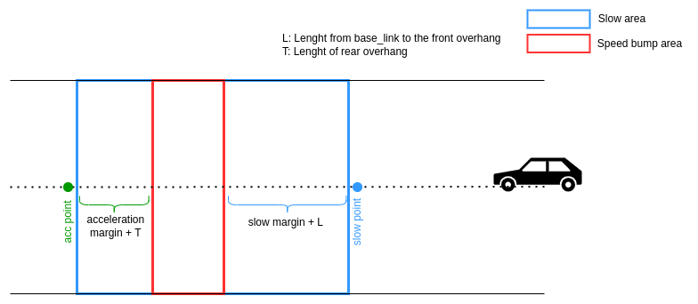

## Crosswalk

### Role

This module slows down the vehicle for speed bump.

### Activation Timing

The manager launch speed bump scene module when there is speed bump regulatory element referring to
the reference path.

### Module Parameters

| Parameter           | Type   | Description                                               |
| ------------------- | ------ | --------------------------------------------------------- |
| `slow_start_margin` | double | [m] margin for ego vehicle to slow down before speed_bump |
| `slow_end_margin`   | double | [m] margin for ego vehicle to accelerate after speed_bump |
| `print_debug_info`  | bool   | whether debug info will be printed or not                 |

### Inner-workings / Algorithms

- Get speed bump regulatory element on the path from lanelet2 map
- Calculate `slow_down_speed` wrt to `speed_bump_height` specified in regulatory element.

- Set `slow_down_speed` to the path during `slow_area`

**Note:** If in speed bump annotation `slow_down_speed` tag is used then calculating the speed wrt
the speed bump height will be ignored. In such case, specified `slow_down_speed` value in **[kph]**
is being used.

### Future Work

- In an article [here](https://journals.sagepub.com/doi/10.1155/2014/736576), a bump modeling method
  is proposed. Simply it is based on fitting the bump in a circle and a radius calculation is done
  with it. Although the velocity calculation is based on just the height of the bump in the recent
  implementation, applying this method is intended in the future which will yield more realistic
  results.
