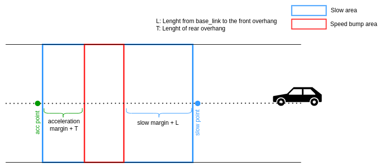
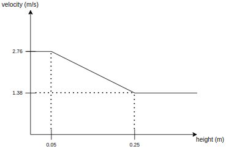

## Speed Bump

### Role

This module plans the speed of the vehicle in case there is a speed bump annotated on the route. The
vehicle must reduce its speed to a constant `slow_velocity` throughout the slow area which starts
from `slow_point` and ends with `acc_point`. As soon as the vehicle is out of the slow area, it
continues to drive according to the conditions ahead on the path.



### Activation Timing

Launches when there is a speed bump on the target lane.

### Inner-workings / Algorithms

- Extract speed bumps on the route using lanelet2 map
- Insert a slow point and an acceleration point which defines a slow area
- Set velocity calculated with `velocityByBumpHeight` function for the waypoints in the slow area

  - `velocityByBumpHeight` function calculates the velocity for the slow area. For simple
    implementation proper velocity calculation was done according to a linear equation with upper
    and lower saturations:

    y = - (1.38/0.20) x + 3.105  
     

- Normal drive after reaching `acc_point` (end of the slow area).

### Module Parameters

| Parameter             | Type   | Description                                                 |
| --------------------- | ------ | ----------------------------------------------------------- |
| `slow_margin`         | double | [m] a margin for ego vehicle to slow down before speed_bump |
| `acceleration_margin` | double | [m] a margin for ego vehicle to accelerate after speed_bump |

### Known Issues

-

### Future Feature

- In an article [here](https://journals.sagepub.com/doi/10.1155/2014/736576), a bump modeling method is proposed. Simply it is based on fitting the
  bump in a circle and a radius calculation is done with it. Although the velocity calculation is
  based on just the height of the bump in the recent implementation, applying this method is
  intended in the future which will yield more realistic results.

### Annotation

- Speed bump annotation is a lanelet annotation (like a crosswalk or a road)  
  And it must look like below:

```xml
<relation id='1176' visible='true' version='1'>
  <member type='way' ref='1174' role='left' />
  <member type='way' ref='1175' role='right' />
  <tag k='participant:vehicle' v='yes' />
  <tag k='subtype' v='speed_bump' />
  <tag k='height' v='0.15' />
  <tag k='type' v='lanelet' />
</relation>
```

- As it can be understood the attributes as follows are variable for each speed bump:
  - `relation id`
  - `way ref id's`
  - `height` (maximum height of the speed bump in [m] to calculate proper velocity to drive on it)

### An Example

- In the link [here](https://drive.google.com/file/d/1yfUZmKn1tcPv5c6k6yEBPJ1HoxhDKzJs/view?usp=sharing) a sample map can be found as an example
- Planning simulator should be run as it is [instructed](https://autowarefoundation.github.io/autoware-documentation/main/tutorials/ad-hoc-simulation/planning-simulation/#1-launch-autoware) with the given sample map above
