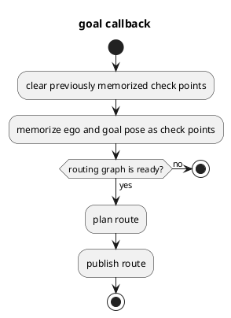
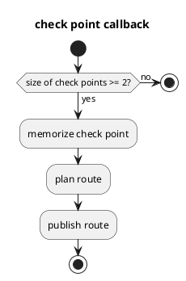
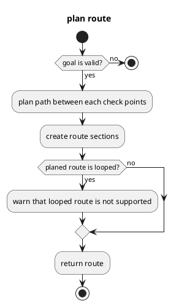

# Mission Planner

## Purpose

`Mission Planner` calculates a route that navigates from the current ego pose to the goal pose following the given check points.
The route is made of a sequence of lanes on a static map.
Dynamic objects (e.g. pedestrians and other vehicles) and dynamic map information (e.g. road construction which blocks some lanes) are not considered during route planning.
Therefore, the output topic is only published when the goal pose or check points are given and will be latched until the new goal pose or check points are given.

The core implementation does not depend on a map format.
In current Autoware.IV, only Lanelet2 map format is supported.

## Inputs / Outputs

### input

| Name                 | Type                               | Description                                |
| -------------------- | ---------------------------------- | ------------------------------------------ |
| `~input/vector_map`  | autoware_lanelet2_msgs/MapBin      | vector map of Lanelet2                     |
| `~input/goal_pose`   | autoware_planning_msgs/PoseStamped | goal pose                                  |
| `~input/checkpoints` | autoware_planning_msgs/PoseStamped | checkpoint to follow while heading to goal |

### output

| Name            | Type                         | Description                 |
| --------------- | ---------------------------- | --------------------------- |
| `~output/route` | autoware_planning_msgs/Route | route from ego pose to goal |

`autoware_planning_msgs/Route` consists of route sections and goal pose.

Route section, whose type is `autoware_planning_msgs/RouteSections`, is a "slice" of a road that bundles lane changeable lanes.
Note that the most atomic unit of route is `lane_id`, which is the unique id of a lane in a vector map.
Therefore, route message does not contain geometric information about the lane since we did not want to have planning module’s message to have dependency on map data structure.

The ROS message of route section contains following three elements for each route section.

- `preferred_lane_id`: Preferred lane to follow towards the goal.
- `continued_lane_ids`: Lanes whose next lane is also in the same direction (e.g. The lane whose next lane is turning right/left although the preferred lane is going straight is not a continued lane). This `continued_lane_ids` is used only for lane change.
- `lane_ids`: All neighbor lanes in the same direction including the preferred lane.

## Implementation

### Mission Planner

Two callbacks (goal and check points) are a trigger for route planning.
Routing graph, which plans route in Lanelet2, must be created before those callbacks, and this routing graph is created in vector map callback.

`plan route` is explained in detail in the following section.

Note that during the goal callback, previously memorized check points are removed, and only current ego pose and goal pose are memorized as check points.

Note that at least two check points must be already memorized, which are start and goal pose, before the check point callback.

### Route Planner

`plan route` is executed with check points including current ego pose and goal pose.

`plan path between each check points` firstly calculates closest lanes to start and goal pose.
Then routing graph of Lanelet2 plans the shortest path from start and goal pose.

`create route sections` extracts `preferred_lane_id`, `continued_lane_ids`, and `lane_ids` for each route section.

## Limitations

- Dynamic objects (e.g. pedestrians and other vehicles) and dynamic map information (e.g. road construction which blocks some lanes) are not considered during route planning.
- Looped route is not supported.
