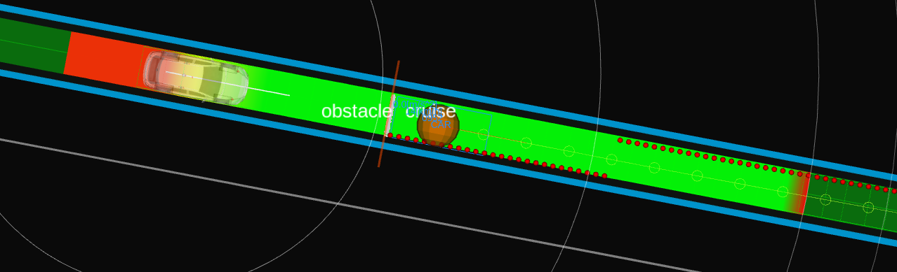

# Obstacle Cruise

## Role

The `obstacle_cruise` module does the cruise planning against a dynamic obstacle in front of the ego.

## Activation

This module is activated if the launch parameter `launch_obstacle_cruise_module` is set to true.

## Inner-workings / Algorithms

### Obstacle Filtering

The obstacles meeting the following condition are determined as obstacles for cruising.

- The lateral distance from the object to the ego's trajectory is smaller than `obstacle_filtering.max_lat_margin`.

- The object type is for cruising according to `obstacle_filtering.object_type.*`.
- The object is not crossing the ego's trajectory (\*1).
- If the object is inside the trajectory.
  - The object type is for inside cruising according to `obstacle_filtering.object_type.inside.*`.
  - The object velocity is larger than `obstacle_filtering.obstacle_velocity_threshold_from_cruise`.
- If the object is outside the trajectory.
  - The object type is for outside cruising according to `obstacle_filtering.object_type.outside.*`.
  - The object velocity is larger than `obstacle_filtering.outside_obstacle.obstacle_velocity_threshold`.
  - The highest confident predicted path collides with the ego's trajectory.
  - Its collision's period is larger than `obstacle_filtering.outside_obstacle.ego_obstacle_overlap_time_threshold`.

#### NOTE

##### \*1: Crossing obstacles

Crossing obstacle is the object whose orientation's yaw angle against the ego's trajectory is smaller than `obstacle_filtering.crossing_obstacle.obstacle_traj_angle_threshold`.

##### Yield for vehicles that might cut in into the ego's lane

It is also possible to yield (cruise) behind vehicles in neighbor lanes if said vehicles might cut in the ego vehicle's current lane.

The obstacles meeting the following condition are determined as obstacles for yielding (cruising).

- The object type is for cruising according to `obstacle_filtering.object_type.*` and it is moving with a speed greater than `obstacle_filtering.yield.stopped_obstacle_velocity_threshold`.
- The object is not crossing the ego's trajectory (\*1).
- There is another object of type `obstacle_filtering.object_type.side_stopped` stopped in front of the moving obstacle.
- The lateral distance (using the ego's trajectory as reference) between both obstacles is less than `obstacle_filtering.yield.max_lat_dist_between_obstacles`
- Both obstacles, moving and stopped, are within `obstacle_filtering.yield.lat_distance_threshold` and `obstacle_filtering.yield.lat_distance_threshold` + `obstacle_filtering.yield.max_lat_dist_between_obstacles` lateral distance from the ego's trajectory respectively.

If the above conditions are met, the ego vehicle will cruise behind the moving obstacle, yielding to it so it can cut in into the ego's lane to avoid the stopped obstacle.

### Cruise Planning

The role of the cruise planning is keeping a safe distance with dynamic vehicle objects with smoothed velocity transition.
This includes not only cruising a front vehicle, but also reacting a cut-in and cut-out vehicle.

The safe distance is calculated dynamically based on the Responsibility-Sensitive Safety (RSS) by the following equation.

$$
d_{rss} = v_{ego} t_{idling} + \frac{1}{2} a_{ego} t_{idling}^2 + \frac{v_{ego}^2}{2 a_{ego}} - \frac{v_{obstacle}^2}{2 a_{obstacle}},
$$

assuming that $d_{rss}$ is the calculated safe distance, $t_{idling}$ is the idling time for the ego to detect the front vehicle's deceleration, $v_{ego}$ is the ego's current velocity, $v_{obstacle}$ is the front obstacle's current velocity, $a_{ego}$ is the ego's acceleration, and $a_{obstacle}$ is the obstacle's acceleration.
These values are parameterized as follows. Other common values such as ego's minimum acceleration is defined in `common.param.yaml`.

| Parameter                                  | Type   | Description                                                                   |
| ------------------------------------------ | ------ | ----------------------------------------------------------------------------- |
| `cruise_planning.idling_time`              | double | idling time for the ego to detect the front vehicle starting deceleration [s] |
| `cruise_planning.min_ego_accel_for_rss`    | double | ego's acceleration for RSS [m/ss]                                             |
| `cruise_planning.min_object_accel_for_rss` | double | front obstacle's acceleration for RSS [m/ss]                                  |

The detailed formulation is as follows.

$$
\begin{align}
d_{error} & = d - d_{rss} \\
d_{normalized} & = lpf(d_{error} / d_{obstacle}) \\
d_{quad, normalized} & = sign(d_{normalized}) *d_{normalized}*d_{normalized} \\
v_{pid} & = pid(d_{quad, normalized}) \\
v_{add} & = v_{pid} > 0 ? v_{pid}* w_{acc} : v_{pid} \\
v_{target} & = max(v_{ego} + v_{add}, v_{min, cruise})
\end{align}
$$

| Variable          | Description                             |
| ----------------- | --------------------------------------- |
| `d`               | actual distance to obstacle             |
| `d_{rss}`         | ideal distance to obstacle based on RSS |
| `v_{min, cruise}` | `min_cruise_target_vel`                 |
| `w_{acc}`         | `output_ratio_during_accel`             |
| `lpf(val)`        | apply low-pass filter to `val`          |
| `pid(val)`        | apply pid to `val`                      |

#### Algorithm selection for cruise planner

Currently, only a PID-based planner is supported.
Each planner will be explained in the following.

| Parameter                   | Type   | Description                                                  |
| --------------------------- | ------ | ------------------------------------------------------------ |
| `option.planning_algorithm` | string | cruise and stop planning algorithm, selected from "pid_base" |

#### PID-based planner

In order to keep the safe distance, the target velocity and acceleration is calculated and sent as an external velocity limit to the velocity smoothing package (`velocity_smoother` by default).
The target velocity and acceleration is respectively calculated with the PID controller according to the error between the reference safe distance and the actual distance.

#### Optimization-based planner

under construction

## Debugging

### Obstacle for cruise

Orange sphere which is an obstacle for cruise is visualized by `obstacles_to_cruise` in the `~/debug/marker` topic.

Orange wall which means a safe distance to cruise if the ego's front meets the wall is visualized in the `~/debug/cruise/virtual_wall` topic.

