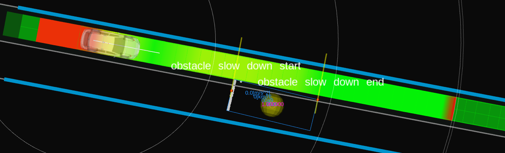

# Obstacle Slow Down

## Role

The `obstacle_slow_down` module does the slow down planning when there is a static/dynamic obstacle near the trajectory.

## Activation

This module is activated if the launch parameter `launch_obstacle_slow_down_module` is set to true.

## Inner-workings / Algorithms

### Obstacle Filtering

Among obstacles which are not for cruising and stopping, the obstacles meeting the following condition are determined as obstacles for slowing down.

- The object type is for slowing down according to `obstacle_filtering.object_type.*`.
- The lateral distance from the object to the ego's trajectory is smaller than `obstacle_filtering.max_lat_margin`.

### Slow Down Planning

The role of the slow down planning is inserting slow down velocity in the trajectory where the trajectory points are close to the obstacles. The parameters can be customized depending on the obstacle type, making it possible to adjust the slow down behavior depending if the obstacle is a pedestrian, bicycle, car, etc. Each obstacle type has a `static` and a `moving` parameter set, so it is possible to customize the slow down response of the ego vehicle according to the obstacle type and if it is moving or not. If an obstacle is determined to be moving, the corresponding `moving` set of parameters will be used to compute the vehicle slow down, otherwise, the `static` parameters will be used. The `static` and `moving` separation is useful for customizing the ego vehicle slow down behavior to, for example, slow down more significantly when passing stopped vehicles that might cause occlusion or that might suddenly open its doors.

An obstacle is classified as `static` if its total speed is less than the `moving_object_speed_threshold` parameter. Furthermore, a hysteresis based approach is used to avoid chattering, it uses the `moving_object_hysteresis_range` parameter range and the obstacle's previous state (`moving` or `static`) to determine if the obstacle is moving or not. In other words, if an obstacle was previously classified as `static`, it will not change its classification to `moving` unless its total speed is greater than `moving_object_speed_threshold` + `moving_object_hysteresis_range`. Likewise, an obstacle previously classified as `moving`, will only change to `static` if its speed is lower than `moving_object_speed_threshold` - `moving_object_hysteresis_range`.

The closest point on the obstacle to the ego's trajectory is calculated.
Then, the slow down velocity is calculated by linear interpolation with the distance between the point and trajectory as follows.

| Variable   | Description                         |
| ---------- | ----------------------------------- |
| `v_{out}`  | calculated velocity for slow down   |
| `v_{min}`  | `min_lat_velocity`                  |
| `v_{max}`  | `max_lat_velocity`                  |
| `l_{min}`  | `min_lat_margin`                    |
| `l_{max}`  | `max_lat_margin`                    |
| `l'_{max}` | `obstacle_filtering.max_lat_margin` |

The calculated velocity is inserted in the trajectory where the obstacle is inside the area with `obstacle_filtering.max_lat_margin`.

## Debugging

### Obstacle for slow down

Yellow sphere which is an obstacle for slow_down is visualized by `obstacles_to_slow_down` in the `~/debug/marker` topic.

Yellow wall which means a safe distance to slow_down if the ego's front meets the wall is visualized in the `~/debug/slow_down/virtual_wall` topic.

