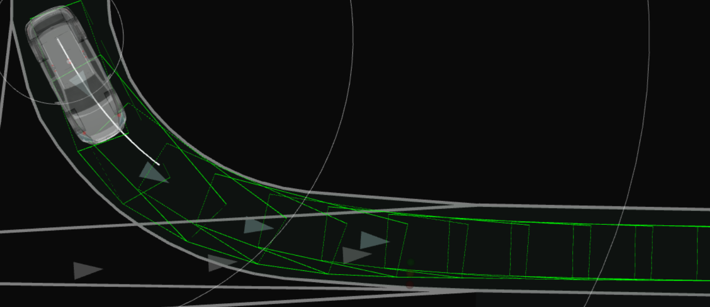
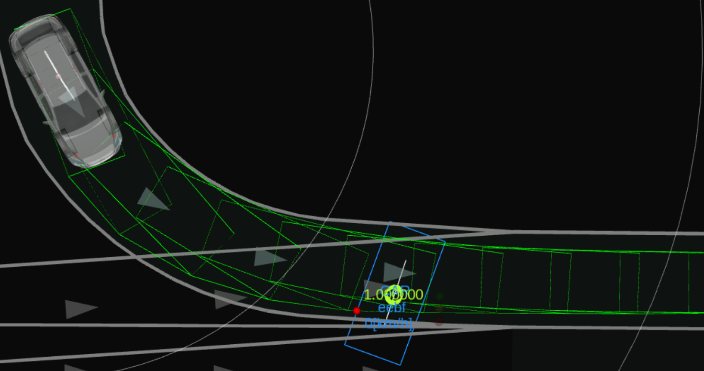
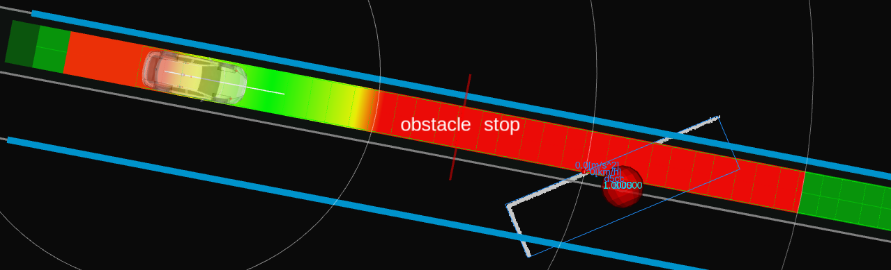

# Obstacle Stop

## Role

The `obstacle_stop` module does the stop planning when there is a static obstacle near the trajectory.

## Activation

This module is activated if the launch parameter `launch_obstacle_stop_module` is set to true.

## Inner-workings / Algorithms

### Obstacle Filtering

The obstacles meeting the following condition are determined as obstacles for stopping.

- The object type is for stopping according to `obstacle_filtering.object_type.*`.
- The lateral distance from the object to the ego's trajectory is smaller than `obstacle_filtering.max_lat_margin`.
- The object velocity along the ego's trajectory is smaller than `obstacle_filtering.obstacle_velocity_threshold_from_stop`.
- The object
  - does not cross the ego's trajectory (\*1)
  - and its collision time margin is large enough (\*2).

#### NOTE

##### \*1: Crossing obstacles

Crossing obstacle is the object whose orientation's yaw angle against the ego's trajectory is smaller than `obstacle_filtering.crossing_obstacle.obstacle_traj_angle_threshold`.

##### \*2: Enough collision time margin

We predict the collision area and its time by the ego with a constant velocity motion and the obstacle with its predicted path.
Then, we calculate a collision time margin which is the difference of the time when the ego will be inside the collision area and the obstacle will be inside the collision area.
When this time margin is smaller than `obstacle_filtering.crossing_obstacle.collision_time_margin`, the margin is not enough.

### Stop Planning

The role of the stop planning is keeping a safe distance with static vehicle objects or dynamic/static non vehicle objects.

The stop planning just inserts the stop point in the trajectory to keep a distance with obstacles.
The safe distance is parameterized as `stop_planning.stop_margin`.
When it stops at the end of the trajectory, and obstacle is on the same point, the safe distance becomes `stop_planning.terminal_stop_margin`.

When inserting the stop point, the required acceleration for the ego to stop in front of the stop point is calculated.
If the acceleration is less than `common.min_strong_accel`, the stop planning will be cancelled since this package does not assume a strong sudden brake for emergency.

### Minor functions

#### Prioritization of behavior module's stop point

When stopping for a pedestrian walking on the crosswalk, the behavior module inserts the zero velocity in the trajectory in front of the crosswalk.
Also `autoware_obstacle_cruise_planner`'s stop planning also works, and the ego may not reach the behavior module's stop point since the safe distance defined in `autoware_obstacle_cruise_planner` may be longer than the behavior module's safe distance.
To resolve this non-alignment of the stop point between the behavior module and this module, `stop_planning.min_behavior_stop_margin` is defined.
In the case of the crosswalk described above, this module inserts the stop point with a distance `stop_planning.min_behavior_stop_margin` at minimum between the ego and obstacle.

#### A function to keep the closest stop obstacle in target obstacles

In order to keep the closest stop obstacle in the target obstacles, we check whether it is disappeared or not from the target obstacles in the `check_consistency` function.
If the previous closest stop obstacle is remove from the lists, we keep it in the lists for `obstacle_filtering.stop_obstacle_hold_time_threshold` seconds.
Note that if a new stop obstacle appears and the previous closest obstacle removes from the lists, we do not add it to the target obstacles again.

## Debugging

### Detection area

Green polygons which is a detection area is visualized by `detection_polygons` in the `~/debug/marker` topic.

### Collision points

Red points which are collision points with obstacle are visualized by `*_collision_points` for each behavior in the `~/debug/marker` topic.

### Obstacle for stop

Red sphere which is an obstacle for stop is visualized by `obstacles_to_stop` in the `~/debug/marker` topic.

Red wall which means a safe distance to stop if the ego's front meets the wall is visualized in the `~/virtual_wall` topic.

