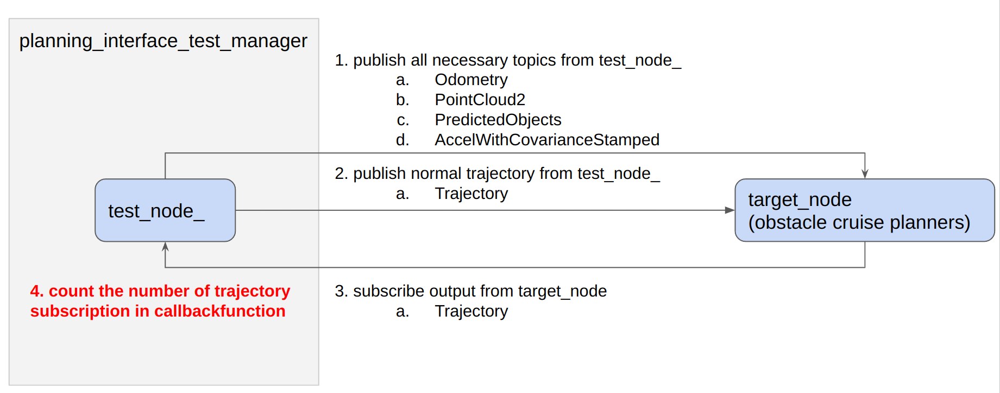

# Planning Test Utils

The Planning Interface Test Manager is a set of utilities and helper functions for testing planning components. It provides a series of helper functions to publish various messages required for launching planning components and methods to run tests with different trajectory route path egp pose scenarios and etc.

## Purpose

The primary goal is to create tests to ensure that nodes do not crash when receiving special inputs, such as trajectory, route, path, ego pose, scenarios, etc., referred to as "exception inputs," during the planning stage. These tests will help validate the robustness of nodes when handling such exception inputs.

## Inner-workings / Algorithms

For each node, the necessary topics will be published from the test*node* to operate the node, and the test will ensure that the node remains functional when encountering exception routes.

There are two main aspects to be verified:

1. Confirm that the required topics are being output from the test*node_and the node is operating correctly.
   a. Publish the topics that the node takes as input from the test_node*.
   - To ensure that the node functions properly, we will provide inputs required for normal operation instead of "exception inputs." This will help confirm the node's correct functioning under expected conditions.
     b. Ensure that the node does not crash.
     c. Check if the final output topic of the node can be subscribed to the test*node*.
2. After confirming the operation above, output exception input (such as an empty route, a route with only one point, or a route with duplicate points for trajectories) from the test*node* and ensure that the node does not crash.
   a. When inputting exception routes, there is no need to publish the final output; it is sufficient to confirm that the node does not crash.

By implementing the tests as described above, the robustness of each node when handling exception routes can be verified, which helps maintain the overall stability of the system.

System Diagram (WIP)

- Normal Operation Test
  

- Abnormal Input Test
  

## Usage

```cpp
#include "planning_interface_test_manager/planning_interface_test_manager.hpp"
#include "behavior_path_planner/behavior_path_planner_node.hpp"
#include "ament_index_cpp/get_package_share_directory.hpp"
#include <gtest/gtest.h>


using behavior_path_planner::BehaviorPathPlannerNode;
using planning_test_utils::PlanningInterfaceTestManager;

TEST(PlanningModuleInterfaceTest, NodeTestWithExceptionRoute)
{
  rclcpp::init(0, nullptr);
  auto test_manager = generateTestManager();
  auto test_target_node = generateNode();

  publishMandatoryTopics(test_manager, test_target_node);

  // test for normal trajectory
  ASSERT_NO_THROW(test_manager->testWithBehaviorNominalRoute(test_target_node));
  EXPECT_GE(test_manager->getReceivedTopicNum(), 1);

  // test with empty route
  test_manager->testWithAbnormalRoute(test_target_node);
  rclcpp::shutdown();
}
```

## Implemented tests

| Node name                                                 | Test name                                      | exception input     | output                                          | Exceptional trajectory/route/path_with_lane_id pattern | Current test result       |
| --------------------------------------------------------- | ---------------------------------------------- | ------------------- | ----------------------------------------------- | ------------------------------------------------------ | ------------------------- |
| planning_validator                                        | NodeTestWithExceptionTrajectory                | trajectory          | trajectory                                      | Empty, single point, path with duplicate points        |                           |
| motion_velocity_smoother                                  | NodeTestWithExceptionTrajectory                | trajectory          | trajectory                                      | Empty, single point, path with duplicate points        | Commented out due to fail |
| obstacle_cruise_planner                                   | NodeTestWithExceptionTrajectory                | trajectory          | trajectory                                      | Empty, single point, path with duplicate points        |                           |
| obstacle_stop_planner                                     | NodeTestWithExceptionTrajectory                | trajectory          | trajectory                                      | Empty, single point, path with duplicate points        |                           |
| obstacle_velocity_limiter                                 | NodeTestWithExceptionTrajectory                | trajectory          | trajectory                                      | Empty, single point, path with duplicate points        |                           |
| obstacle_avoidance_planner                                | NodeTestWithExceptionTrajectory                | trajectory          | trajectory                                      | Empty, single point, path with duplicate points        |                           |
| scenario_selector                                         | NodeTestWithExceptionTrajectoryLaneDrivingMode |
| NodeTestWithExceptionTrajectoryParkingMode                | trajectory                                     | scenario            | Empty, single point, path with duplicate points |
| There are 2 patterns of scenarios:LANEDRIVING and PARKING |                                                |
| freespace_planner                                         | NodeTestWithExceptionRoute                     | route               | trajectory                                      | Empty route                                            |                           |
| behavior_path_planner                                     | NodeTestWithExceptionRoute                     | route, ego position | path_with_lane_id                               | Empty route, TBD                                       |                           |
| behavior_velocity_planner                                 | NodeTestWithExceptionPathWithLaneID            | path_with_lane_id   | path                                            | Empty path                                             |                           |

## Assumptions / Known limits

When launch a node, the parameters are loaded from the package's parameter file, which is located in the config directory.Please be aware that if there are missing parameters, the node can't be launched during testing.

## Future extensions / Unimplemented parts
