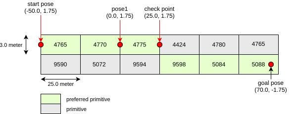

# route handler

`route_handler` is a library for calculating driving route on the lanelet map.

## Unit Testing

The following illustrates the route that are used in the unit test

### Lane change test route

- The route is based on map that can be obtained from `planning_test_utils\test_map`
