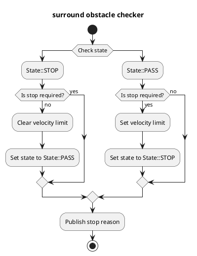

# Surround Obstacle Checker

## Purpose

`surround_obstacle_checker` is a module that plans to stop the ego-vehicle from starting when the ego-vehicle is stopped and there are obstacles around the ego-vehicle.

## Inner-workings / Algorithms

### Flow chart

  

### Algorithms

### Check data

Checks if pointcloud, dynamic objects, and ego vehicle speed data are available.

### Get distance to nearest object

Calculate the distance between the ego-vehicle and the nearest obstacle.
Here we calculate the distance to the nearest obstacle by calculating the distance between the ego-vehicle's polygon and the polygons of each point in the pointcloud and each dynamic object.

### Stop condition

Start planning to stop the ego-vehicle when all of the following conditions are met:

- Ego-vehicle is stopped
- Satify one of the following conditions:
  1. The distance to nearest neighbor obstacle satisfies the following conditions
     - When `State::PASS`, less than `surround_check_distance`
     - When `State::STOP`, less than or equal to `surround_check_recover_distance`
  2. When 1 is not satisfied, the elapsed time from the time when 1 is satisfied, is less than or equal to `state_clear_time`

### States

To prevent from chattering, `surround_obstacle_checker` manages states.
As described in the "Stop condition" section, this module prevents from chattering by changing the obstacle determination threshold depending on the state.

- `State::PASS`: Stopping plan is being cleared
- `State::STOP`: Stopping plan is under execution

## Inputs / Outputs

### Input

| Name                                           | Type                                                   | Description                                                        |
| ---------------------------------------------- | ------------------------------------------------------ | ------------------------------------------------------------------ |
| `/perception/obstacle_segmentation/pointcloud` | `sensor_msgs::msg::PointCloud2`                        | Pointcloud of obstacles which the ego-vehicle should stop or avoid |
| `/perception/object_recognition/objects`       | `autoware_auto_perception_msgs::msg::PredictedObjects` | Dynamic objects                                                    |
| `/localization/kinematic_state`                | `nav_msgs::msg::Odometry`                              | Current twist                                                      |
| `/tf`                                          | `tf2_msgs::msg::TFMessage`                             | TF                                                                 |
| `/tf_static`                                   | `tf2_msgs::msg::TFMessage`                             | TF static                                                          |

### Output

| Name                                    | Type                                                  | Description                  |
| --------------------------------------- | ----------------------------------------------------- | ---------------------------- |
| `~/output/velocity_limit_clear_command` | `tier4_planning_msgs::msg::VelocityLimitClearCommand` | Velocity limit clear command |
| `~/output/max_velocity`                 | `tier4_planning_msgs::msg::VelocityLimit`             | Velocity limit command       |
| `~/output/no_start_reason`              | `diagnostic_msgs::msg::DiagnosticStatus`              | No start reason              |
| `~/output/stop_reasons`                 | `tier4_planning_msgs::msg::StopReasonArray`           | Stop reasons                 |
| `~/debug/marker`                        | `visualization_msgs::msg::MarkerArray`                | Marker for visualization     |

## Parameters

| Name                              | Type     | Description                                                                            | Default value |
| :-------------------------------- | :------- | :------------------------------------------------------------------------------------- | :------------ |
| `use_pointcloud`                  | `bool`   | Use pointcloud as obstacle check                                                       | `true`        |
| `use_dynamic_object`              | `bool`   | Use dynamic object as obstacle check                                                   | `true`        |
| `surround_check_distance`         | `double` | If objects exist in this distance, transit to "exist-surrounding-obstacle" status [m]  | 0.5           |
| `surround_check_recover_distance` | `double` | If no object exists in this distance, transit to "non-surrounding-obstacle" status [m] | 0.8           |
| `state_clear_time`                | `double` | Threshold to clear stop state [s]                                                      | 2.0           |
| `stop_state_ego_speed`            | `double` | Threshold to check ego vehicle stopped [m/s]                                           | 0.1           |
| `stop_state_entry_duration_time`  | `double` | Threshold to check ego vehicle stopped [s]                                             | 0.1           |

## Assumptions / Known limits

When the pointcloud of obstacles is not detectable because of the ego-vehicle's blind spot, the module will not perform planning to stop.
