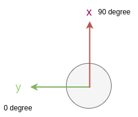

# distortion_corrector

## Purpose

The `distortion_corrector` is a node that compensates for pointcloud distortion caused by the ego-vehicle's movement during one scan.

Since the LiDAR sensor scans by rotating an internal laser, the resulting point cloud will be distorted if the ego-vehicle moves during a single scan (as shown by the figure below). The node corrects this by interpolating sensor data using the odometry of the ego-vehicle.

## Inner-workings / Algorithms

The node uses twist information (linear and angular velocity) from the `~/input/twist` topic to correct each point in the point cloud. If the user sets `use_imu` to true, the node will replace the twist's angular velocity with the angular velocity from IMU.

The node supports two different modes of distortion correction: 2D distortion correction and 3D distortion correction. The main difference is that the 2D distortion corrector only utilizes the x-axis of linear velocity and the z-axis of angular velocity to correct the point positions. On the other hand, the 3D distortion corrector utilizes all linear and angular velocity components to correct the point positions.

Please note that the processing time difference between the two distortion methods is significant; the 3D corrector takes 50% more time than the 2D corrector. Therefore, it is recommended that in general cases, users should set `use_3d_distortion_correction` to `false`. However, in scenarios such as a vehicle going over speed bumps, using the 3D corrector can be beneficial.


## Inputs / Outputs

### Input

| Name                 | Type                                             | Description                        |
| -------------------- | ------------------------------------------------ | ---------------------------------- |
| `~/input/pointcloud` | `sensor_msgs::msg::PointCloud2`                  | Topic of the distorted pointcloud. |
| `~/input/twist`      | `geometry_msgs::msg::TwistWithCovarianceStamped` | Topic of the twist information.    |
| `~/input/imu`        | `sensor_msgs::msg::Imu`                          | Topic of the IMU data.             |

### Output

| Name                  | Type                            | Description                         |
| --------------------- | ------------------------------- | ----------------------------------- |
| `~/output/pointcloud` | `sensor_msgs::msg::PointCloud2` | Topic of the undistorted pointcloud |

## Parameters

### Core Parameters

{{ json_to_markdown("sensing/autoware_pointcloud_preprocessor/schema/distortion_corrector_node.schema.json") }}

## Launch

```bash
ros2 launch autoware_pointcloud_preprocessor distortion_corrector.launch.xml
```

## Assumptions / Known limits

- The node requires time synchronization between the topics from lidars, twist, and IMU.
- If you want to use a 3D distortion corrector without IMU, please check that the linear and angular velocity fields of your twist message are not empty.
- The node updates the per-point azimuth and distance values based on the undistorted XYZ coordinates when the input point cloud is in the sensor frame (not in the `base_link`) and the `update_azimuth_and_distance` parameter is set to `true`. The azimuth values are calculated using a modified version of OpenCV's `cv::fastAtan2` function.
- Please note that updating the azimuth and distance fields increases the execution time by approximately 20%. Additionally, due to the `cv::fastAtan2` algorithm's has a maximum error of 0.3 degrees, there is a **possibility of changing the beam order for high azimuth resolution LiDAR**.
- LiDARs from different vendors have different azimuth coordinates, as shown in the images below. Currently, the coordinate systems listed below have been tested, and the node will update the azimuth based on the input coordinate system.
  - `velodyne`: (x: 0 degrees, y: 270 degrees)
  - `hesai`: (x: 90 degrees, y: 0 degrees)
  - `others`: (x: 0 degrees, y: 90 degrees) and (x: 270 degrees, y: 0 degrees)

<table>
  <tr>
    <td></td>
    <td></td>
   </tr>
   <tr>
    <td><p style="text-align: center;">Velodyne azimuth coordinate</p></td>
    <td><p style="text-align: center;">Hesai azimuth coordinate</p></td>
  </tr>
</table>

## References/External links

<https://docs.opencv.org/3.4/db/de0/group__core__utils.html#ga7b356498dd314380a0c386b059852270>
