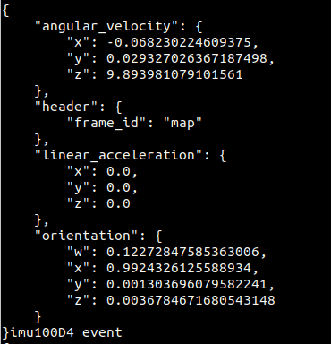

# Dora-rs imu_corrector
## 文件清单

**src/imu_corrector_core.cc**  IMU较正节点
**config/imu_corrector.param.yml**   IMU默认数据
**dataflow.yml**   Dora数据流文件

## 编译

```bash
mkdir build && cd build
cmake ..
cmake --build .
```

## 运行
```bash
#在imu_corrector路径下
dora up
dora start dataflow.yml --name test
dora logs test imu_corrector
```
发送的数据为如下的JSON格式：




# 问题

问题1：python数据流发送到C++后，C++发送不出去了，报错。

```bash
  2024-03-25T04:16:48.878571Z ERROR dora_node_api_c: unknown output

Location:
    apis/rust/node/src/node/mod.rs:205:13
    at apis/c/node/src/lib.rs:238
```

原因：`.cc`代码里`out_id`和`.yml`的`output`名称不一样，保持一致就解决了。
