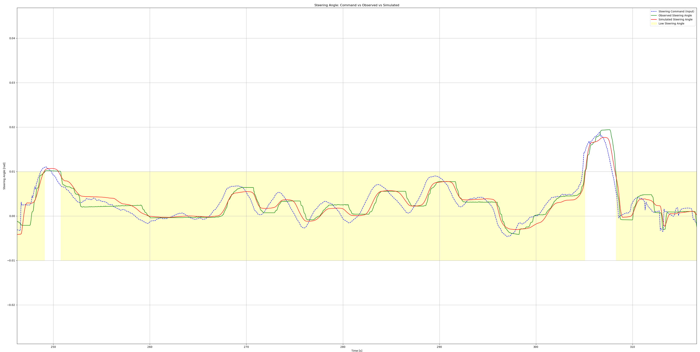

# ACTUATION_CMD model

The simple_planning_simulator usually operates by receiving Control commands, but when the `ACTUATION_CMD*` model is selected, it receives Actuation commands instead of Control commands. This model can simulate the motion using the vehicle command that is actually sent to the real vehicle. Therefore, when this model is selected, the `raw_vehicle_cmd_converter` is also launched.

## ACTUATION_CMD

This model receives the accel/brake commands and converts them using the map to calculate the motion of the model. The steer command is used as it is.
Please make sure that the raw_vehicle_cmd_converter is configured as follows.

```yaml
convert_accel_cmd: true
convert_brake_cmd: true
convert_steer_cmd: false
```

## ACTUATION_CMD_STEER_MAP

This model is inherited from ACTUATION_CMD and receives steering arbitrary value as the actuation command.
The value is converted to the steering tire rate to calculate the motion of the model. An arbitrary value is like EPS (Electric Power Steering) Voltage.

Please make sure that the raw_vehicle_cmd_converter is configured as follows.

```yaml
convert_accel_cmd: true
convert_brake_cmd: true
convert_steer_cmd: true
```

## ACTUATION_CMD_VGR

This model is inherited from ACTUATION_CMD and steering wheel angle is sent as the actuation command.
The value is converted to the steering tire angle to calculate the motion of the model.

Please make sure that the raw_vehicle_cmd_converter is configured as follows.

```yaml
convert_accel_cmd: true
convert_brake_cmd: true
convert_steer_cmd: true
```


## ACTUATION_CMD_MECHANICAL

This model is inherited from ACTUATION_CMD_VGR nad has mechanical dynamics and controller for that to simulate the mechanical structure and software of the real vehicle.

Please make sure that the raw_vehicle_cmd_converter is configured as follows.

```yaml
convert_accel_cmd: true
convert_brake_cmd: true
convert_steer_cmd: true
```

The mechanical structure of the vehicle is as follows.


The vehicle side software assumes that it has limiters, PID controllers, power steering, etc. for the input.
The conversion in the power steering is approximated by a polynomial.
Steering Dynamics is a model that represents the motion of the tire angle when the Steering Torque is input. It is represented by the following formula.

```math
\begin{align}
\dot{\theta} &= \omega \\
\dot{\omega} &= \frac{1}{I} (T_{\text{input}} - D \omega - K \theta - \text{sign}(\omega) F_{\text{friction}} ) \\
\end{align}
```

In this case,

- $\theta$ : Tire angle
- $\omega$ : Tire angular velocity
- $T_{\text{input}}$ : Input torque
- $D$ : Damping coefficient
- $K$ : Spring constant
- $F_{\text{friction}}$ : Friction force
- $I$ : Moment of inertia

Also, this dynamics has a dead zone.
The steering rotation direction is different from the steering torque input direction, and the steering torque input is less than the dead zone threshold, it enters the dead zone. Once it enters the dead zone, it is judged to be in the dead zone until there is a steering input above the dead zone threshold. When in the dead zone, the steering tire angle does not move.

Please refer to the following file for the values of the parameters that have been system-identified using the actual vehicle's driving data.
The blue line is the control input, the green line is the actual vehicle's tire angle output, and the red line is the simulator's tire angle output.
[mechanical_sample_param](../param/simple_planning_simulator_mechanical_sample.param.yaml)

This model has a smaller sum of errors with the observed values of the actual vehicle than when tuned with a normal first-order lag model. For details, please refer to [#9252](https://github.com/autowarefoundation/autoware_universe/pull/9300).



The parameters used in the ACTUATION_CMD are as follows.

| Name                | Type   | Description                                                                                                                                                              | unit |
| :------------------ | :----- | :----------------------------------------------------------------------------------------------------------------------------------------------------------------------- | :--- |
| accel_time_delay    | double | dead time for the acceleration input                                                                                                                                     | [s]  |
| accel_time_constant | double | time constant of the 1st-order acceleration dynamics                                                                                                                     | [s]  |
| brake_time_delay    | double | dead time for the brake input                                                                                                                                            | [s]  |
| brake_time_constant | double | time constant of the 1st-order brake dynamics                                                                                                                            | [s]  |
| convert_accel_cmd   | bool   | If true, it is assumed that the command is received converted to an accel actuation value, and it is converted back to acceleration value inside the simulator.          | [-]  |
| convert_brake_cmd   | bool   | If true, it is assumed that the command is received converted to a brake actuation value, and it is converted back to acceleration value inside the simulator.           | [-]  |
| vgr_coef_a          | double | the value of the coefficient a of the variable gear ratio                                                                                                                | [-]  |
| vgr_coef_b          | double | the value of the coefficient b of the variable gear ratio                                                                                                                | [-]  |
| vgr_coef_c          | double | the value of the coefficient c of the variable gear ratio                                                                                                                | [-]  |
| enable_pub_steer    | bool   | whether to publish the steering tire angle. if false, it is expected to be converted and published from actuation_status in other nodes (e.g. raw_vehicle_cmd_converter) | [-]  |
