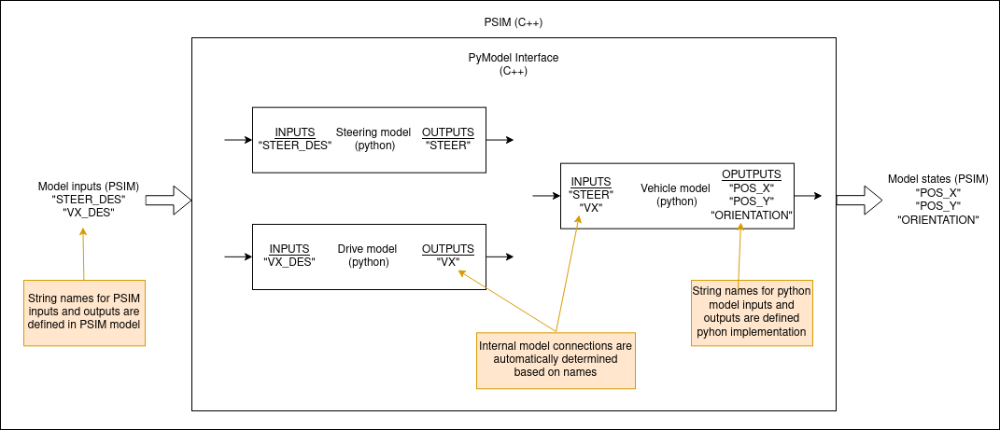

# Learned Model

This is the design document for the Python learned model used in the `simple_planning_simulator` package.

## Purpose / Use cases

<!-- Required -->
<!-- Things to consider:
    - Why did we implement this feature? -->

This library creates an interface between models in Python and PSIM (C++). It is used to quickly deploy learned Python models in PSIM without a need for complex C++ implementation.

## Design

<!-- Required -->
<!-- Things to consider:
    - How does it work? -->

Using this Python model interface a PSIM model consisting of sub-models implemented in Python can be created. Each sub-model has string names for all of its inputs/outputs which are used to automatically create model interconnections (see image below).  



## Assumptions / Known limits

<!-- Required -->

To use this package `python3` and `pybind11` need to be installed. The only assumption on Python sub-models is their interface (see below).

```python
class CustomPythonSubmodel:

    def forward(self, action, state):  # Required
        """
        Calculate forward pass through the model and returns next_state.
        """
        return list()
    
    def get_state_names(self):  # Required
        """
        Return list of string names of the model states (outputs).
        """
        return list()

    def get_action_names(self):  # Required
        """
        Return list of string names of the model actions (inputs).
        """
        return list()

    def reset(self):  # Required
        """
        Reset model. This function is called after load_params().
        """
        pass

    def load_params(self, path):  # Optional
        """
        Load parameters of the model. 
        Inputs:
            - path: Path to a parameter file to load by the model.
        """
        pass
```

## API

<!-- Required -->
<!-- Things to consider:
    - How do you use the package / API? -->

To successfully create a vehicle model an InterconnectedModel class needs to be set up correctly. 

### InterconnectedModel class

#### ```Constructor```
Constructor takes no arguments.

#### ```addSubmodel(model_desc)```

#### ```generateConnections(input_names, state_names)```

#### ```initState(current_state)```

#### ```updatePymodel(vehicle_input)```

### Example
Firstly we need to set up the model.
```C++
InterconnectedModel vehicle;

// Example of model descriptors
std::tuple<char*, char*, char*> model_desc_1 = {
    (char*)"path_to_file_with_model_class_1",
    (char*)nullptr,  // If no param file is needed you can pass 'nullptr' 
    (char*)"ModelClass1"
  };

std::tuple<char*, char*, char*> model_desc_2 =   {
      (char*)"path_to_file_with_model_class_2",
      (char*)"/path_to/param_file",
      (char*)"ModelClass2"  // Name of the python class. Needs to use the interface from 'Assumptions'
    }

// Create sub-models based on descriptors
vehicle.addSubmodel(model_desc_1);
vehicle.addSubmodel(model_desc_2);

// Define STATE and INPUT names of the system
std::vector<char*> state_names = {(char*)"STATE_NAME_1", (char*)"STATE_NAME_2"};
std::vector<char*> input_names = {(char*)"INPUT_NAME_1", (char*)"INPUT_NAME_2"};

// Automatically connect sub-systems with model input 
vehicle.generateConnections(input_names, state_names);
```

After the model is correctly set up, we can use it the following way. 

```C++
// Example of an model input
std::vector<double> vehicle_input = {0.0, 1.0}; // INPUT_NAME_1, INPUT_NAME_2

// Example of an model state
std::vector<double> current_state = {0.2, 0.5}; // STATE_NAME_1, STATE_NAME_2

// Set model state 
vehicle.initState(current_state);

// Calculate the next state of the model
std::vector<double> next_state = vehicle.updatePymodel(vehicle_input);
```

## References / External links

<!-- Optional -->

## Related issues

<!-- Required -->
