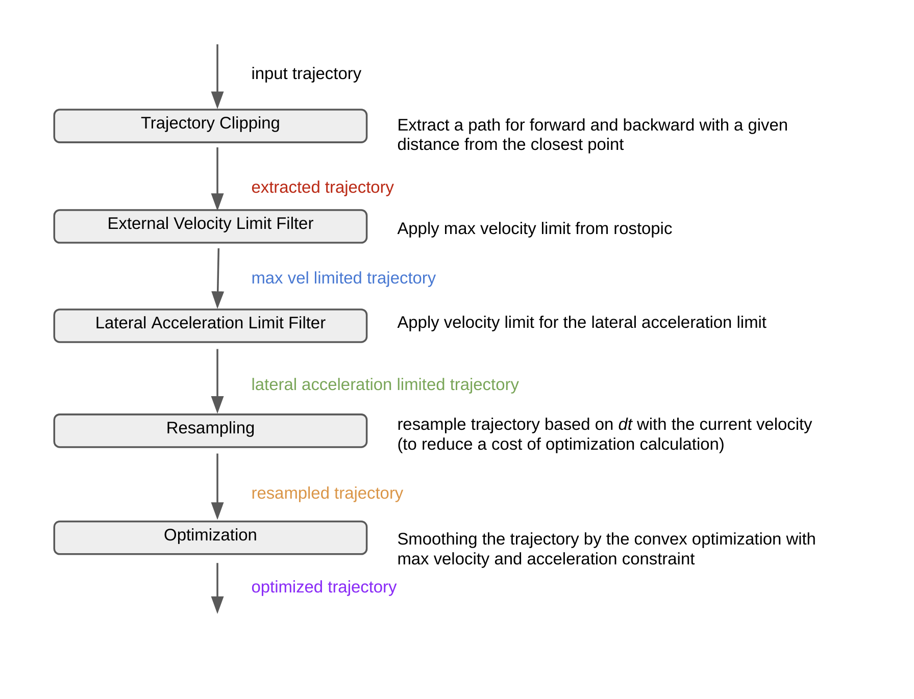
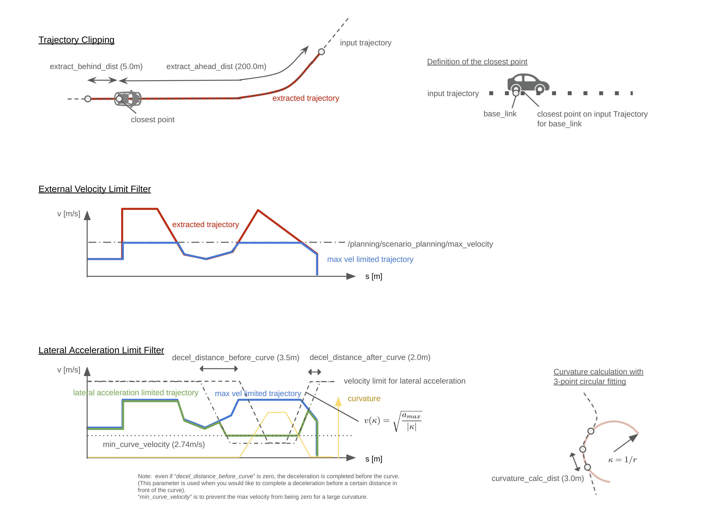
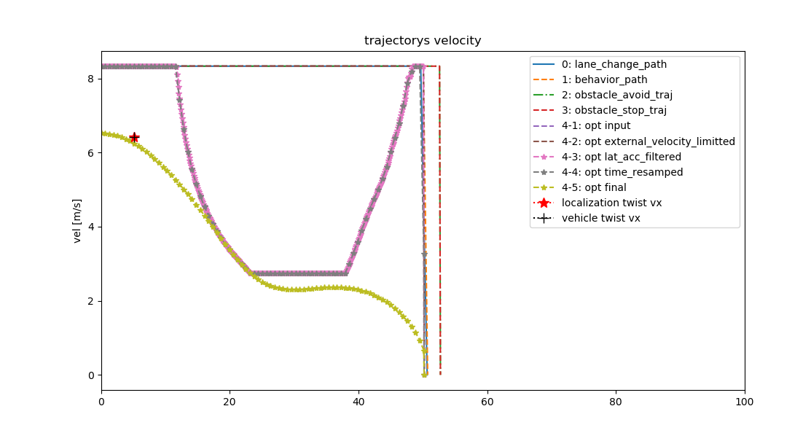

# Role
Smoothens the reference path velocity with velocity and acceleration limit constraint.

# Flowchart

The overall flowchart of the `motion_velocity_optimizer` is described below.

  

# Feature details

  

  

# Node

## Topic

**Subscribed Topic**

 - **~input/trajectory**  `[autoware_planning_msgs::Trajectory]`
   - reference trajectory with max velocity
   - trigger for computation
 - **/localization/twist** `[geometry_msgs::TwistStamped]`
   - ego-vehicle velocity source
 - **/planing/scenario_planning/max_velocity** `[std_msgs::Float32]`
   -  external command for max velocity

**Published Topic**
 - **~output/trajectory**  `[autoware_planning_msgs::Trajectory]`
   - trajectory with optimized velocity

 

# TF

**Published TF**
 - None

**Subscribed TF**
 - `/map` to `/base_link`
   - used to get the closest trajectory point

# Parameter description

The parameters are described on `config/default_motion_velocity_optimizer.yaml`

## Constrant parameters
|Name|Type|Description|Default value|
|:--|:--|:--|:--|
|max_velocity|  double|   Max velocity limit [m/s] | 20.0  |
|max_accel|  double|       Max acceleration limit [m/ss] | 1.0   |
|min_decel|  double|       Min deceleration limit [m/ss] | -1.0  |

## Curve parameters
|Name|Type|Description|Default value|
|:--|:--|:--|:--|
|max_lateral_accel| double | Max lateral acceleration limit [m/ss] | 0.5 
|min_curve_velocity| double | Min velocity at lateral acceleration limit [m/ss] | 2.74
|decel_distance_before_curve| double | Slow speed distance before a curve for lateral acceleration limit | 3.5 
|decel_distance_after_curve| double | Slow speed distance after a curve for lateral acceleration limit | 2.0 

## Engage & replan parameters
|Name|Type|Description|Default value|
|:--|:--|:--|:--|
|replan_vel_deviation| double | Velocity deviation to replan initial velocity [m/s]|5.53|
|engage_velocity| double | Engage velocity threshold [m/s] (if the trajectory velocity is higher than this value, use this velocity for engage vehicle speed)|0.25|
|engage_acceleration| double | Engage acceleration [m/ss] (use this acceleration when engagement)|0.1 |
|engage_exit_ratio| double  | Exit engage sequence to normal velocity plannning when the velocity exceeds engage_exit_ratio x engage_velocity.|0.5 |
|stop_dist_to_prohibit_engage| double | If the stop point is in this distance, the speed is set to 0 not to move the vehicle [m]|0.5 |

## For trajectory clipping & resampling
|Name|Type|Description|Default value|
|:--|:--|:--|:--|
|extract_ahead_dist| double | Forward trajectory distance used for planning [m] |  200.0  |
|extract_behind_dist| double | backward trajectory distance used for planning [m] |  5.0    |
|delta_yaw_threshold| double | Allowed delta yaw between ego pose and trajecotory pose [radian] |  1.0472 |
|max_trajectory_length| double |Max trajectory length for resampling [m]|  200.0|
|min_trajectory_length| double |Min trajectory length for resampling [m]|  30.0 |
|resample_time| double |Resample total time [s]|  10.0 |
|resample_dt| double |Resample time interval [s]|  0.1  |
|min_trajectory_interval_distance| double |Resample points-interval length [m]|  0.1 |

## Weights for optimization
|Name|Type|Description|Default value|
|:--|:--|:--|:--|
|pseudo_jerk_weight| double | Weight for "smoothness" cost |  100.0  |
|over_v_weight| double |  Weight for "overspeed limit" cost |  100000.0|
|over_a_weight| double |  Weight for "overaccel limit" cost |  1000.0  |

## Others
|Name|Type|Description|Default value|
|:--|:--|:--|:--|
|publish_debug_trajs| bool| publish trajectories on each computation|false|

# Results

  

Trajectories of No.4-1~4-5 shows the output of each functions in this node. 4-5 is the output of this `motion_velocity_optimizer`. 

# Reference
[1] Zhang Yu, et al. (2018). Toward a More Complete, Flexible, and Safer Speed Planning for Autonomous Driving via Convex Optimization. Sensors. 18. 2185. 10.3390/s18072185.

[2] Stellato, et al. (2020). OSQP: an operator splitting solver for quadratic programs. Mathematical Programming Computation. 10.1007/s12532-020-00179-2. https://doi.org/10.1007/s12532-020-00179-2