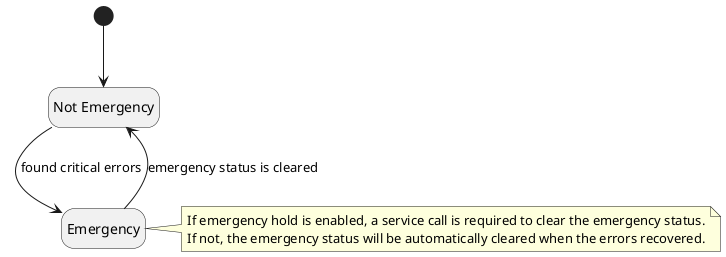
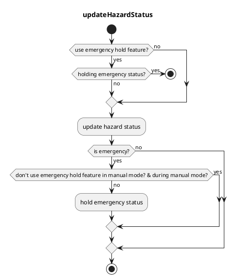

# emergency_handler

## Feature Details

### emergency hold

`emergency_handler` has an optional feature to hold emergency status once after it becomes emergency status.
This is controlled by `use_emergency_hold` parameter.

It's useful for keeping the error reasons.
For example, when some errors occurred and recovered soon, it's difficult to know why they happened, because the error diagnostics will disappear after recovery.

Since manual driving gives unexpected effects to the autonomous driving system, we usually don't need to know the error reasons during manual driving, but sometimes you'll want to know them for debugging.
So you can choose whether to hold emergency status during manual driving.
This is controlled by `use_emergency_hold_in_manual_driving` parameter.

It's implemented as whether to update status in `updateHazardStatus()` function.
If there is no update, the status will be kept.

#### State Transition

#### Flowchart

