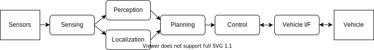
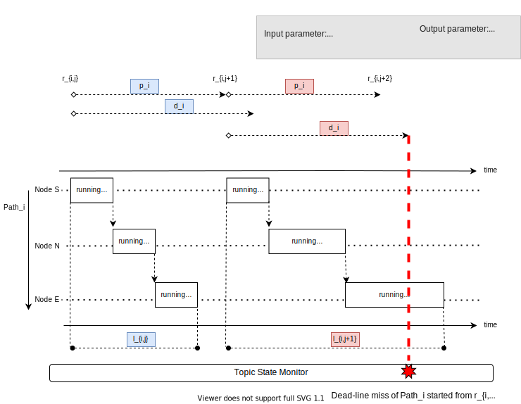

# Design Overview

**NOTE: It has not been implemented yet.**

## Description

Autonomous driving is a real-time system. The **Topic State Monitor** checks the real-time constraints of the system. To achieve the real-time constraints, a certain monitoring functionality is required to detect when nodes are performing below tolerance and react appropriately.

This figure shows the high-level architecture of Autoware.
An autonomous driving system consists of a set of functions.
Each function would be implemented as a ROS node or a set of ROS nodes.
A set of functions would have a real-time constraint.

| [Path](<https://en.wikipedia.org/wiki/Path_(graph_theory)>)                 | Real-Time Constraint      |
| --------------------------------------------------------------------------- | ------------------------- |
| Sensors > Sensing > Perception > Planning > Control > Vehicle I/F > Vehicle | Brake reaction distance   |
| Planning > Control > Vehicle I/F > Vehicle                                  | Braking distance accuracy |
| Vehicle > Vehicle I/F > Control > Vehicle I/F > Vehicle                     | Control accuracy          |
| Sensors > Sensing > Localization                                            | Localization accuracy     |

This table shows examples of real-time constraints.
Each column shows a real-time constraint corresponding to a path in the architecture graph.

## Formulation

[A path in a graph is a finite sequence of edges which joins a sequence of vertices which are all distinct (and since the vertices are distinct, so are the edges)](<https://en.wikipedia.org/wiki/Path_(graph_theory)>).
The words `trail` and `walk` are not used in this context since each node and edge would have only one role in a path
even if they appear multiple times in the path.

A path is an unit that has a real-time constraint.
A system has a set of paths.

Each `Path_i` has a set of nodes. The starting point of `Path_i` is `Node S`. The end point of `Path_i` is `Node E`.
`Path_i` would have the other nodes `Node N` between `Node S` and `Node E`.
`Node S` and `Node E` would be a same node if a function that has a real-time
constraint is implemented in one node.

`Node S` is invoked (released) at every `p_i` period.
The release time of `j`-th job of `Path_i` is `r_{i,j}`. `Node S` would be immediately executed at the release time if `Node S` is immediately scheduled at the release time by the scheduler of operating system.
`Node S` would not be executed immediately at the release if other nodes are selected to be scheduled on CPUs.

`Node N` and `Node E` can be executed once each node subscribes a depending topic in `Path_i`, i.e., the nodes of `Path_i` is executed sequentially.

A latency of a `j`-th job of `Path_i` is presented by `l_{i,j}`, which is the latency between `r_{i,j}` and the completion of `j`-th job of `Node E`.
`l_{i,j}` may be larger than `p_i`.

The relative deadline of `Path_i` is `d_i`.
If `l_{i,j} <= d_i` for all `j`, `Path_i` meets its real-time constraint.

The period `p_i` and the relative deadline `d_i` does not have the parameter `j`
since this formulation assumes that `p_i` and `d_i` are static parameters,
which are not changed at run-time.

## Requirements

| #             | System Requirement                                                     | Related Component   |
| ------------- | ---------------------------------------------------------------------- | ------------------- |
| Requirement 1 | The system shall detect deadline misses (i.e., `l_{i,j} > d_i`).       | Topic State Monitor |
| Requirement 2 | The system can trigger some actions once deadline misses are detected. | Emergency Handler   |

## Limitation

- The relative deadline `d_i` of `Path_i` has static value. `d_i` does not change at runtime with change in for example the velocity of ego-vehicle. This limitation comes from the assumption that `d_i` shall be the minimum value that can be safe in a given ODD.
- Not interrupt callback or node execution
- Not control over error handling outside of autoware (e.g. normal detection using heart-beats on the hardware side)

## Design

The design of Topic State Monitor focuses on Requirement 1. Requirement 2 is designed in [Emergency Handler](https://github.com/autowarefoundation/autoware.universe/tree/main/system/emergency_handler).

Topic State Monitor subscribes the topic published by `Node E` in `Path_i`.
Topic State Monitor detects a deadline miss of the `j`-th job of `P_i`
if Topic State Monitor does not subscribe the topic by `r_{i,j} + d_i`.

Since Topic State Monitor would not subscribe the `j`-th topic of `Node E`
before the deadline, Topic State Monitor shall detect deadline misses by
time-out.
Topic State Monitor saves `r_{i,j-1}` in the initialization phase to calculate
the absolute deadline of `j`-th job in the detection phase.
The initialization phase and the detection phase are executed at every `j`.

Existing timestamp value in each topic may not fit for Dead-line miss detection.
Since topic's timestamp may be passed to the next node unchanged from the previous value, or it may be overwritten in current topic. It depends on each node's specification.
To determine using existing timestamp, it is needed to check the specifications of all the nodes in the Path.
If it is difficult to use, add a new field for Dead-line miss detection.

### Early detection

If user wants to detect a dead-line miss in the middle of a Path, user specify it by defining multiple Path as below.

- ex) Whole `Path_i` is defined as: **`Node S` -> `Node N1` -> `Node N2` -> `Node E`**
  - early detect on Node S: define additional Path as `Node S`
  - early detect on Node N2: define additional Path as `Node S` -> `Node N1` -> `Node N2`
  - detect on Node E: `Node S` -> `Node N1` -> `Node N2` -> `Node E` (same as `Path_i`)

## Initialization Phase

1. `Node S` sets `r_{i,j-1}` into a topic, and publishes the topic into `Path_i`.
2. `Node N` and `Node E` relays `r_{i,j-1}` on topics without modification.
3. Topic State Monitor saves `r_{i,j-1}` for the Detection Phase.

## Detection Phase

1. Topic State Monitor calculates `r_{i,j} = r{i,j-1} + p_i`.
2. Topic State Monitor calculates the absolute deadline = `r_{i,j} + d_i`.
3. If (1) Topic State Monitor does not subscribe the topic in `Path_i` and
   (2) the current time exceeds the absolute deadline, Topic State Monitor publishes the deadline miss event via `/diagnostics` topic.

## Implementation Challenge

- How Topic State Monitor handles `j = 1`
  - `r_{i,j-1}` is not defined at `j = 1`. `j = 1` is the system initialization. Topic State Monitor could use `if`-guard or ROS2 node lifecycle to wait the system initialization.
- How `Node S` gets `r_{i,j-1}` in the initialization phase.
  - The design assumes that `Node S` sets `r_{i,j-1}` and does not set the start time of `Node S` into the topic. If the period of `Node S` is triggered by for example sensor hardware, `r_{i,j-1}` should consider the latency of the sensor.

## Another Design

This section describes another design that is not employed.

| Design                                                                                  | Reason why not employed                                                                                    |
| --------------------------------------------------------------------------------------- | ---------------------------------------------------------------------------------------------------------- |
| Topic State Monitor gets `r_{i,1}`, and calculates `r_{i,j} = r_{r,1} + p_i * (j - 1)`. | `r_{i,j}` might slip forward or backward gradually if `p_i` stored in Topic State Monitor is not accurate. |
