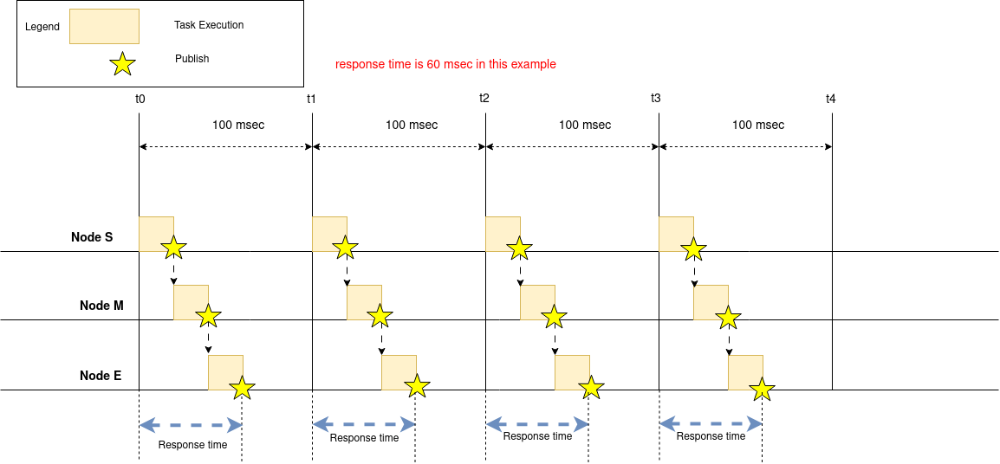
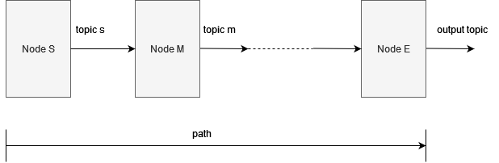
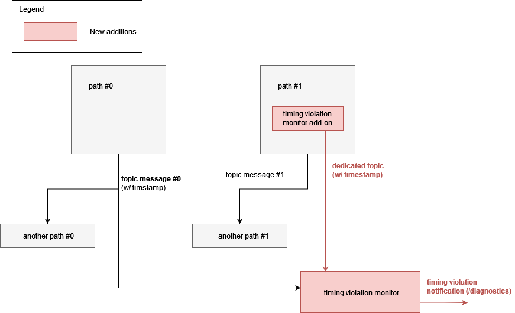
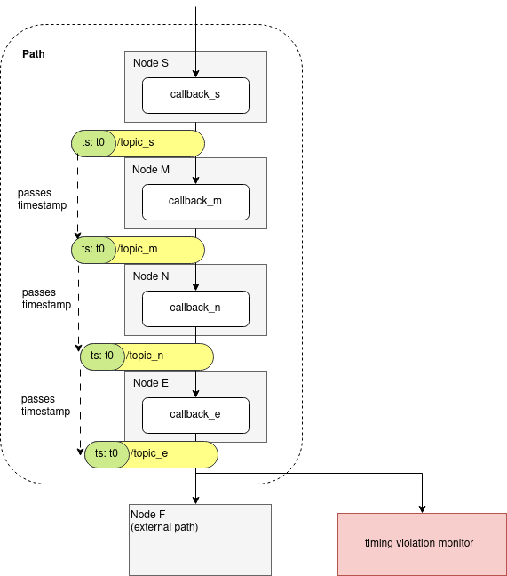
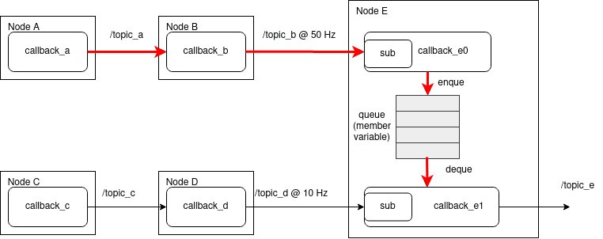
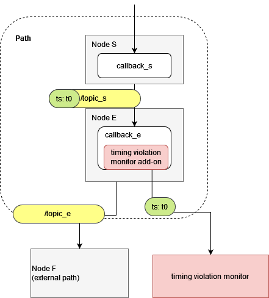

# Detailed Design

## Background

Currently, there is no common mechanism for detecting timing violation. Autoware is a real-time system, which means that the software shall save time constraints and use more fresh data. If time constraints cannot be saved, any function failed, and it may be difficult to continue the service.

For example, Localization is one of the critical features of Autoware, and it has time constraints.

Localization consists of multiple features such as point cloud filter nodes, NDT Scan Matcher, and EKF Localizer. The sequence of processes consisting of these must observe time constraints. If the time constraints are not observed, there is a concern that self-location estimation will fail.

The requirements are described in [the high-level design document](./design_timing_violation_detection.md).

### Expected achievement

- Detection of timing violations in existing features which has time constraints
- Detection of timing violations caused by hardware, e.g., thermal throttling
- Stable timing violation detection by external monitoring

The timing violation monitor is able to observe the response time of paths as shown in the following figure.

## Timing violation monitor and its framework

### Design policy

Autoware consists of multiple nodes. Some data is passed to subsequent nodes using inter process communication with topic messages, and nodes process the data in order.

As shown in the figure below, the chain of nodes from the starting node (`Node S`) to the end node (`Node E`) is defined as path. The timing violation monitor verifies that the time constraints of the path are saved.

The initial design of the timing violation framework is intended to be deployed as a small start, and is designed with the following three points.

- Minimize changes to Autoware user code as much as possible
- Have the flexibility to add or delete paths
- Run in a different Linux process than the monitored entity in order to keep the monitored entity stable
  - Avoid delays in the execution of the monitored entity

As described in more detail below, timing violation monitor refers to the header timestamp of existing topic messages as much as possible in order to avoid modifying existing Autoware user code.

On the other hand, depending on the implementation of the endpoint of the path, there is a possibility that the header timestamp cannot be referenced. In this case, a dedicated message is used instead of the header timestamp of existing topic message.

### Design overview

As shown in the diagram below, the following two will be added by timing violation detection framework.

- timing violation monitor node
- dedicated topic message
  - add-on function to output the topic message

The timing violation monitor subscribes the following two types of topic messages

- Existing topic messages with timestamp sent from the end node of the Path
- Dedicated topic messages which pass timestamp from starting node of the Path

The timing violation monitor checks violation occurrence based on the timestamps in these messages. The monitor notifies timing violation occurrence to the upper-level monitor tools, for example, the /diagnostics topic.

Path #0 in the above diagram shows the case scenario where timing violation detection is accomplished by referencing an existing topic message, and Path #1 shows the case scenario where timing violation detection is accomplished by using a dedicated topic message.

### Precondition on timestamp

In order to achieve this functionality, timestamps included in topic messages sent from the path are important.

When timing violation monitor refers to an existing topic message, it is assumed that the timestamp given by the starting node of the path is pass to the end node, as shown in the following diagram.

In the diagram shown above, the timestamp sent from `Node S` is outputted from `Node E`. In Autoware, the point cloud topic messages of the Sensing, Perception, and Localization nodes are transmitted in this way.

In this case, the timing violation monitor can refer to the header timestamp to know if the path save the time constraints without any change in the user code.

### Consumption notification

On the other hand, there are some cases where the header timestamp given at the starting node is not sent from the end node of the path.

#### Motivation to serve the dedicated message

The following figure shows an example of those cases.

The destination node, `Node E`, of the path has two callback functions that run at different frequencies. I can define two paths that pass `Node E`, the `Path 1` from `Node A` to `Node E` and `Path 2` from `Node C` to `Node D`. `callback_e0` is the callback that only receives the topic message and passes it to `callback_e1` via the member variable queue.

As well as explained above, the start of `Path 2` is the `callback_c` and the end is `callback_e1` where `callback_e1` sends `/topic_e`.
On the other hand, the end of `Path 1` has two candidates; `callback_e0` which receives the message and `callback_e1` which consumes it. To carefully check whether Autoware works as expected, we think, `callback_e1` should be the end of `Path 1`.

In this example, it is difficult to trace from external when the message is consumed in `callback_e1`. Then, `callback_e1` has to notify consumption of the queued message to external. That’s why we want to introduce a new publisher for this kind of node.

#### Solution using the dedicated message

In those cases, a dedicated message is output as shown in the diagram below. With the dedicated message, the node is able to notify consumption of the topic message sent from the starting node.

In the diagram shown above, the timestamp output from `Node S` is not output from `Node E`, so Add-on outputs the dedicated message with the timestamp output from `Node S`.

If the data size of `/topic_e` is too large to be received by the timing violation monitor, the data transfer overhead can be reduced by using a dedicated message.
